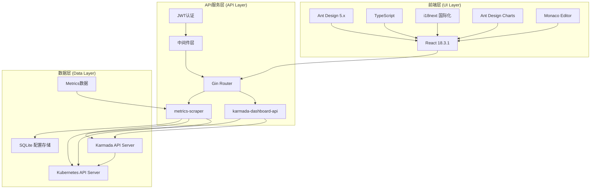
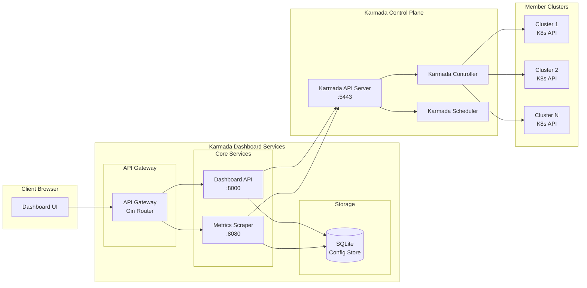
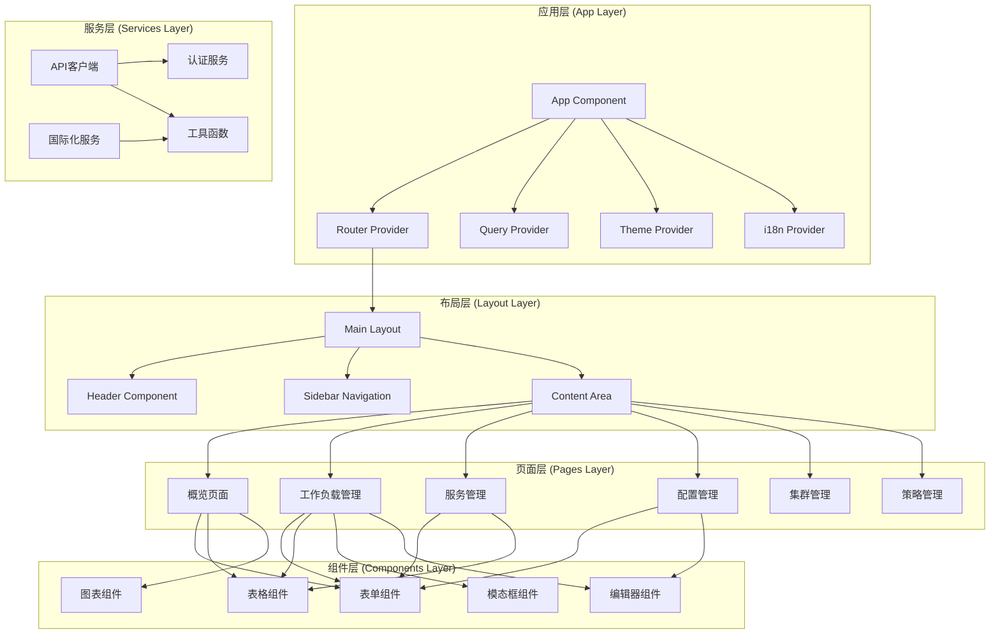
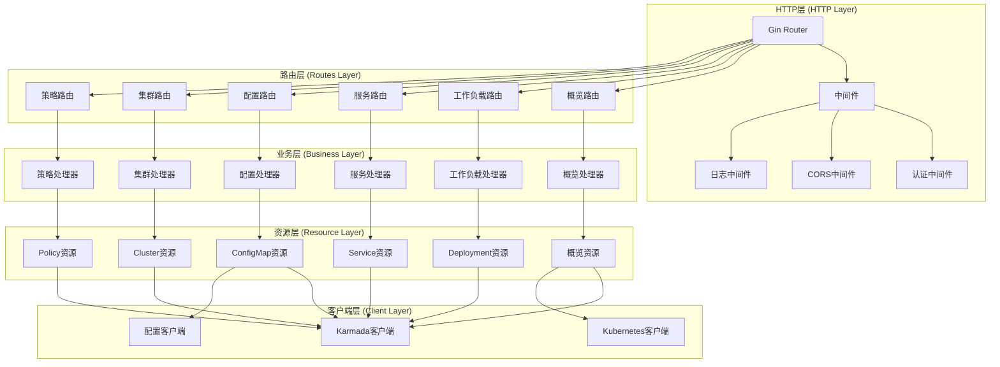
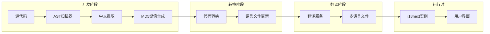
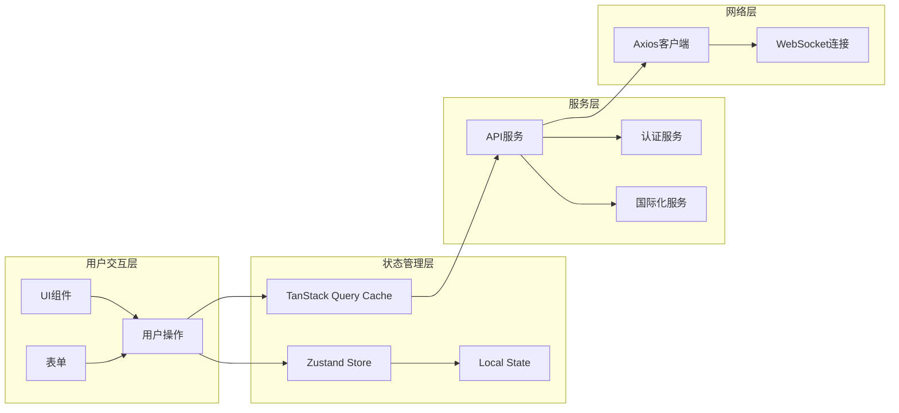
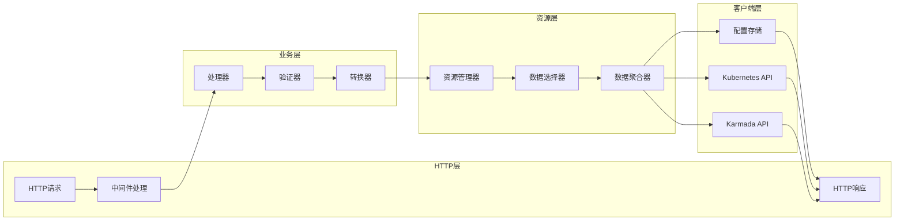
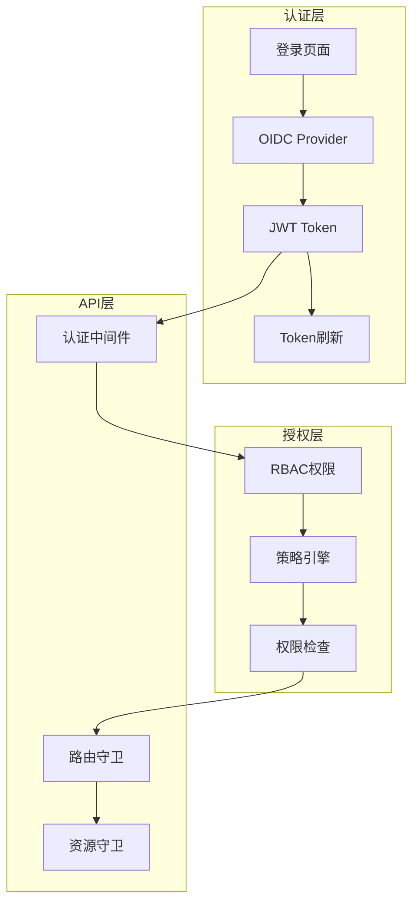

# 架构设计文档 (Architecture Specification) - Karmada-Manager 用户体验优化

## 1. 文档信息

### 1.1 版本历史

| 版本号 | 日期       | 作者      | 变更说明       |
| ------ | ---------- | --------- | -------------- |
| 1.0    | 2024-12-19 | 架构设计师 | 初版架构设计文档 |

### 1.2 文档目的

本文档基于PRD需求和用户故事地图，设计Karmada-Manager（特别是Karmada-Dashboard）用户体验优化项目的整体架构，为后端和前端开发团队提供详细的技术指导。

### 1.3 相关文档

- `doc/agent/PRD.md` - 产品需求文档
- `doc/agent/User_Story_Map.md` - 用户故事地图
- `doc/agent/Arch/API_Spec.md` - API定义文档
- `doc/agent/Arch/Database_Spec.md` - 数据设计文档
- `doc/agent/Arch/Guide_Spec.md` - 开发指南

## 2. 系统架构概览

### 2.1 整体架构

Karmada-Dashboard采用三层架构设计：
- **前端层（UI Layer）**: React + TypeScript + Ant Design
- **API服务层（API Layer）**: Go + Gin + RESTful APIs
- **数据层（Data Layer）**: Kubernetes API + Karmada API + 配置存储



### 2.2 服务组件架构



## 3. 技术栈选型

### 3.1 前端技术栈

| 技术分类         | 选择方案              | 版本    | 选择理由                                    |
| ---------------- | -------------------- | ------- | ------------------------------------------- |
| **前端框架**     | React                | 18.3.1  | 成熟的组件化框架，生态丰富                     |
| **开发语言**     | TypeScript           | 5.6.3   | 强类型支持，提升代码质量和开发效率              |
| **UI组件库**     | Ant Design           | 5.21.3  | 企业级UI组件库，设计语言成熟                   |
| **路由管理**     | React Router DOM     | 6.26.2  | React生态标准路由解决方案                      |
| **状态管理**     | Zustand              | 4.5.5   | 轻量级状态管理，易于使用                       |
| **HTTP客户端**   | Axios                | 1.7.7   | 功能强大的HTTP客户端                          |
| **数据查询**     | TanStack Query       | 5.59.8  | 强大的服务端状态管理                          |
| **图标组件**     | Ant Design Icons     | 6.0.0   | 与Ant Design配套的图标库                     |
| **数据可视化**   | Ant Design Charts    | 2.4.0   | 基于G2的图表库，与Ant Design集成好            |
| **代码编辑器**   | Monaco Editor        | 0.48.0  | VS Code核心编辑器，支持YAML/JSON高亮          |
| **国际化**       | i18next              | 23.15.2 | 功能完善的国际化框架                          |
| **i18n工具**     | @karmada/i18n-tool   | 1.0.0   | 自动化国际化工具，支持AST解析和自动翻译        |
| **翻译服务**     | @karmada/translators | 1.0.0   | 支持百度、DeepL、OpenAI等多种翻译服务        |
| **样式工具**     | Tailwind CSS         | 3.4.13  | 实用优先的CSS框架                            |
| **构建工具**     | Vite                 | 5.4.8   | 快速的前端构建工具                            |

### 3.2 后端技术栈

| 技术分类         | 选择方案              | 版本    | 选择理由                                    |
| ---------------- | -------------------- | ------- | ------------------------------------------- |
| **开发语言**     | Go                   | 1.22.12 | 高性能、并发支持好，云原生生态成熟              |
| **Web框架**      | Gin                  | 1.9.1   | 高性能的Go Web框架                           |
| **Kubernetes客户端** | client-go         | 0.31.3  | Kubernetes官方Go客户端                       |
| **Karmada集成**  | karmada             | 1.13.0  | Karmada核心库，提供多集群管理能力              |
| **数据库**       | SQLite/GORM         | 1.25.7  | 轻量级嵌入式数据库，用于配置存储               |
| **认证授权**     | JWT                 | 5.2.1   | 无状态认证方案                               |
| **日志系统**     | klog                | 2.130.1 | Kubernetes生态标准日志库                      |
| **监控集成**     | Prometheus          | 0.55.0  | 指标采集和监控                               |
| **配置管理**     | Cobra               | 1.8.1   | 命令行参数和配置管理                          |

### 3.3 基础设施技术栈

| 技术分类         | 选择方案              | 版本    | 选择理由                                    |
| ---------------- | -------------------- | ------- | ------------------------------------------- |
| **容器运行时**   | Docker              | Latest  | 标准容器化方案                               |
| **编排平台**     | Kubernetes          | 1.31+   | 容器编排标准平台                             |
| **多集群管理**   | Karmada             | 1.13.0  | 云原生多集群管理平台                         |
| **监控系统**     | Prometheus/Grafana  | Latest  | 可观测性标准方案                             |
| **构建工具**     | Docker/Makefile     | -       | 构建和部署自动化                             |

## 4. 组件设计

### 4.1 前端组件架构



### 4.2 后端组件架构



## 5. 核心功能模块设计

### 5.1 概览页面模块

**功能描述**: 提供Karmada控制面和成员集群的全局状态视图

**组件设计**:
```typescript
// 前端组件结构
OverviewPage
├── KarmadaStatusCard          // Karmada状态卡片
├── ClusterSummaryCard         // 集群汇总卡片
├── ResourceSummaryCard        // 资源汇总卡片
├── ResourceTrendChart         // 资源趋势图表
├── PolicySummaryCard          // 策略汇总卡片
├── EventListPanel             // 事件列表面板
└── QuickActionPanel           // 快捷操作面板
```

**后端模块结构**:
```go
// 后端处理器结构
type OverviewHandler struct {
    karmadaClient   karmadaclientset.Interface
    kubeClient      kubernetes.Interface
    metricsClient   MetricsClientInterface
}

// 主要方法
func (h *OverviewHandler) GetOverview() (*v1.OverviewResponse, error)
func (h *OverviewHandler) GetKarmadaInfo() (*v1.KarmadaInfo, error)
func (h *OverviewHandler) GetMemberClusterStatus() (*v1.MemberClusterStatus, error)
func (h *OverviewHandler) GetClusterResourceStatus() (*v1.ClusterResourceStatus, error)
```

### 5.2 资源管理模块

**功能描述**: 提供表单化的Kubernetes资源创建、编辑和管理

**组件设计**:
```typescript
// 资源管理组件结构
ResourceManagement
├── ResourceList               // 资源列表
│   ├── FilterPanel           // 筛选面板
│   ├── SearchBox             // 搜索框
│   ├── DataTable             // 数据表格
│   └── PaginationControls    // 分页控件
├── ResourceForm               // 资源表单
│   ├── BasicInfoSection      // 基本信息
│   ├── SpecSection           // 规格配置
│   ├── PolicySection         // 策略配置
│   └── AdvancedSection       // 高级配置
├── ResourceDetail             // 资源详情
│   ├── MetadataPanel         // 元数据面板
│   ├── StatusPanel           // 状态面板
│   ├── EventsPanel           // 事件面板
│   └── YAMLViewer            // YAML查看器
└── YAMLEditor                 // YAML编辑器
```

### 5.3 可视化调度策略模块

**功能描述**: 提供图形化的PropagationPolicy调度策略配置

**组件设计**:
```typescript
// 可视化调度组件结构
SchedulingVisualizer
├── ClusterResourceView        // 集群资源视图
│   ├── ClusterCards          // 集群卡片
│   ├── ResourceMetrics       // 资源指标
│   └── ClusterFilter         // 集群筛选
├── PolicyConfigPanel          // 策略配置面板
│   ├── ClusterSelection      // 集群选择
│   ├── AffinityRules         // 亲和性规则
│   ├── SpreadConstraints     // 分布约束
│   └── Tolerations           // 污点容忍
├── SchedulingTreeView         // 调度关系树
│   ├── PolicyNode            // 策略节点
│   ├── RuleNodes             // 规则节点
│   └── ClusterNodes          // 集群节点
└── SchedulingPreview          // 调度预览
    ├── SimulationPanel       // 模拟面板
    └── ResultVisualization   // 结果可视化
```

### 5.4 国际化模块

**功能描述**: 基于AST解析的自动化国际化系统，支持多语言和自动翻译

**组件架构**:
```typescript
// 国际化系统架构
I18nSystem
├── I18nInstance              // i18next实例
├── LanguageConfig            // 语言配置管理
│   ├── supportedLangConfig  // 支持的语言配置
│   ├── getLang()            // 获取当前语言
│   ├── setLang()            // 设置语言
│   └── getAntdLocale()      // 获取Ant Design语言包
├── I18nTool (@karmada/i18n-tool)  // 自动化工具
│   ├── ASTScanner           // AST扫描器
│   ├── CodeTransformer      // 代码转换器
│   ├── MD5KeyGenerator      // MD5键值生成器
│   └── LocaleUpdater        // 语言文件更新器
├── Translators (@karmada/translators) // 翻译服务
│   ├── BaiduTranslator      // 百度翻译
│   ├── DeepLTranslator      // DeepL翻译
│   ├── OpenAITranslator     // OpenAI翻译
│   └── BaseTranslator       // 翻译基类
└── LocaleResources           // 语言资源
    ├── zh-CN.json           // 中文资源(MD5键值)
    ├── en-US.json           // 英文资源(MD5键值)
    └── glossaries.csv       // 术语表
```

**核心特性**:
- **AST解析**: 基于Babel的AST解析，精确提取和替换中文字符
- **MD5键值**: 使用MD5哈希生成唯一、稳定的键值
- **多翻译源**: 支持百度、DeepL、OpenAI等多种翻译服务
- **自动化工作流**: 扫描->转换->翻译->更新的完整自动化流程
- **配置驱动**: 通过i18n.config.cjs统一管理所有配置

**工作流程**:


## 6. 数据流架构

### 6.1 前端数据流



### 6.2 后端数据流



## 7. 安全架构

### 7.1 认证授权设计



### 7.2 数据安全

- **传输安全**: 使用HTTPS/TLS加密所有HTTP通信
- **认证安全**: 支持OIDC、JWT等标准认证方式
- **授权安全**: 严格遵循Kubernetes RBAC权限模型
- **数据脱敏**: 敏感数据（如Secret）在传输和展示时进行脱敏处理
- **审计日志**: 记录关键操作的审计日志

## 8. 性能架构

### 8.1 前端性能优化

- **代码分割**: 使用React.lazy()和动态import实现路由级代码分割
- **组件缓存**: 使用React.memo和useMemo优化组件渲染
- **数据缓存**: 使用TanStack Query实现智能数据缓存
- **虚拟滚动**: 大数据量列表使用虚拟滚动技术
- **资源压缩**: 使用Vite进行代码压缩和资源优化

### 8.2 后端性能优化

- **连接池**: Kubernetes和Karmada客户端使用连接池
- **数据聚合**: 在服务端聚合数据，减少API调用次数
- **缓存机制**: 使用内存缓存热点数据
- **异步处理**: 使用Go协程处理并发请求
- **数据分页**: 大数据量查询使用分页机制

### 8.3 监控指标

- **响应时间**: API平均响应时间 < 500ms
- **吞吐量**: 支持至少50个并发用户
- **可用性**: 系统可用性 > 99.9%
- **错误率**: API错误率 < 1%

## 9. 部署架构

### 9.1 容器化部署

```yaml
# Docker镜像构建
FROM node:18-alpine AS frontend-builder
WORKDIR /app
COPY ui/apps/dashboard/package.json .
RUN npm install
COPY ui/apps/dashboard .
RUN npm run build

FROM golang:1.22-alpine AS backend-builder
WORKDIR /app
COPY go.mod go.sum ./
RUN go mod download
COPY . .
RUN go build -o karmada-dashboard-api cmd/api/main.go

FROM alpine:latest
RUN apk --no-cache add ca-certificates
WORKDIR /root/
COPY --from=backend-builder /app/karmada-dashboard-api .
COPY --from=frontend-builder /app/dist ./ui
CMD ["./karmada-dashboard-api"]
```

### 9.2 Kubernetes部署

```yaml
apiVersion: apps/v1
kind: Deployment
metadata:
  name: karmada-dashboard
  namespace: karmada-system
spec:
  replicas: 2
  selector:
    matchLabels:
      app: karmada-dashboard
  template:
    metadata:
      labels:
        app: karmada-dashboard
    spec:
      containers:
      - name: dashboard
        image: karmada/dashboard:latest
        ports:
        - containerPort: 8000
        env:
        - name: KARMADA_KUBECONFIG
          value: /etc/karmada/kubeconfig
        volumeMounts:
        - name: karmada-config
          mountPath: /etc/karmada
      volumes:
      - name: karmada-config
        secret:
          secretName: karmada-kubeconfig
```

## 10. 扩展性设计

### 10.1 插件架构

- **前端插件**: 支持动态加载外部React组件
- **后端插件**: 支持注册自定义路由和处理器
- **API扩展**: 支持第三方API集成
- **主题扩展**: 支持自定义主题和样式

### 10.2 集成能力

- **监控集成**: 支持Prometheus、Grafana等监控系统
- **日志集成**: 支持ELK、Loki等日志系统
- **认证集成**: 支持OIDC、LDAP等认证系统
- **存储集成**: 支持多种配置存储后端

这份架构设计文档为Karmada-Dashboard的开发提供了全面的技术指导，确保系统的可扩展性、可维护性和高性能。 