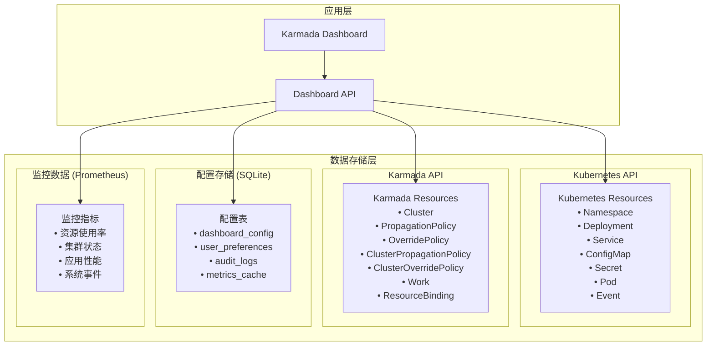
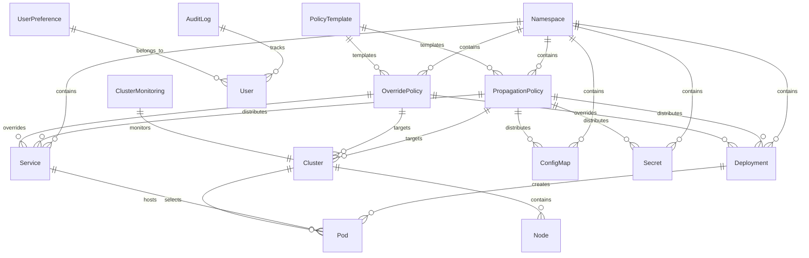

# 数据设计文档 (Database Specification) - Karmada-Manager 用户体验优化

## 1. 文档信息

### 1.1 版本历史

| 版本号 | 日期       | 作者      | 变更说明       |
| ------ | ---------- | --------- | -------------- |
| 1.0    | 2024-12-19 | 架构设计师 | 初版数据设计文档 |

### 1.2 文档目的

本文档基于现有项目的数据模型分析和PRD需求，设计Karmada-Dashboard的完整数据架构，包括Kubernetes原生资源、Karmada扩展资源、配置存储等数据模型设计。

### 1.3 数据存储架构

Karmada-Dashboard采用多层数据存储架构：
- **Kubernetes API层**: 存储标准Kubernetes资源
- **Karmada API层**: 存储Karmada扩展资源（策略、集群等）
- **配置存储层**: SQLite存储Dashboard配置和用户数据
- **监控数据层**: Prometheus存储监控指标数据

## 2. 数据存储架构图



## 3. Kubernetes 原生资源数据模型

### 3.1 Namespace 数据模型

```typescript
interface NamespaceModel {
  // 元数据
  objectMeta: {
    name: string;              // 命名空间名称
    labels: Record<string, string>;    // 标签
    annotations: Record<string, string>; // 注解
    creationTimestamp: string; // 创建时间
    uid: string;              // 唯一标识符
  };
  
  // 状态信息
  status: {
    phase: 'Active' | 'Terminating';
  };
  
  // Dashboard扩展信息
  dashboardInfo?: {
    propagationPolicy?: string; // 关联的分发策略
    resourceCount: {           // 资源统计
      deployments: number;
      services: number;
      configMaps: number;
      secrets: number;
    };
  };
}
```

### 3.2 Deployment 数据模型

```typescript
interface DeploymentModel {
  // 元数据
  objectMeta: {
    name: string;
    namespace: string;
    labels: Record<string, string>;
    annotations: Record<string, string>;
    creationTimestamp: string;
    uid: string;
  };
  
  // 类型元数据
  typeMeta: {
    kind: 'Deployment';
    scalable: true;
    restartable: true;
  };
  
  // 规格定义
  spec: {
    replicas: number;
    selector: {
      matchLabels: Record<string, string>;
    };
    template: {
      metadata: {
        labels: Record<string, string>;
      };
      spec: {
        containers: ContainerSpec[];
        initContainers?: ContainerSpec[];
        volumes?: VolumeSpec[];
      };
    };
    strategy?: {
      type: 'RollingUpdate' | 'Recreate';
      rollingUpdate?: {
        maxSurge: string;
        maxUnavailable: string;
      };
    };
  };
  
  // 状态信息
  status: {
    replicas: number;
    updatedReplicas: number;
    readyReplicas: number;
    availableReplicas: number;
    observedGeneration: number;
    conditions: ConditionSpec[];
  };
  
  // Dashboard扩展信息
  dashboardInfo: {
    status: 'Running' | 'Pending' | 'Failed' | 'Unknown';
    containerImages: string[];
    initContainerImages: string[];
    propagationPolicy?: string;
    clusterDistribution?: ClusterDistribution[];
  };
}

interface ContainerSpec {
  name: string;
  image: string;
  ports?: PortSpec[];
  env?: EnvSpec[];
  resources?: ResourceSpec;
  volumeMounts?: VolumeMountSpec[];
  livenessProbe?: ProbeSpec;
  readinessProbe?: ProbeSpec;
}

interface PortSpec {
  name?: string;
  containerPort: number;
  protocol: 'TCP' | 'UDP';
}

interface ResourceSpec {
  requests?: {
    cpu?: string;
    memory?: string;
  };
  limits?: {
    cpu?: string;
    memory?: string;
  };
}

interface ClusterDistribution {
  clusterName: string;
  replicas: number;
  readyReplicas: number;
  status: string;
}
```

### 3.3 Service 数据模型

```typescript
interface ServiceModel {
  objectMeta: {
    name: string;
    namespace: string;
    labels: Record<string, string>;
    annotations: Record<string, string>;
    creationTimestamp: string;
    uid: string;
  };
  
  typeMeta: {
    kind: 'Service';
    scalable: false;
    restartable: false;
  };
  
  spec: {
    type: 'ClusterIP' | 'NodePort' | 'LoadBalancer' | 'ExternalName';
    selector?: Record<string, string>;
    ports: ServicePortSpec[];
    clusterIP?: string;
    externalIPs?: string[];
    loadBalancerIP?: string;
    sessionAffinity?: 'None' | 'ClientIP';
  };
  
  status: {
    loadBalancer?: {
      ingress?: Array<{
        ip?: string;
        hostname?: string;
      }>;
    };
  };
  
  dashboardInfo: {
    endpointAddresses: EndpointAddress[];
    propagationPolicy?: string;
  };
}

interface ServicePortSpec {
  name?: string;
  port: number;
  targetPort: number | string;
  protocol: 'TCP' | 'UDP';
  nodePort?: number;
}

interface EndpointAddress {
  ip: string;
  hostname?: string;
  targetRef?: {
    kind: string;
    name: string;
    namespace: string;
  };
}
```

### 3.4 ConfigMap/Secret 数据模型

```typescript
interface ConfigMapModel {
  objectMeta: {
    name: string;
    namespace: string;
    labels: Record<string, string>;
    annotations: Record<string, string>;
    creationTimestamp: string;
    uid: string;
  };
  
  typeMeta: {
    kind: 'ConfigMap';
    scalable: false;
    restartable: false;
  };
  
  data: Record<string, string>;
  binaryData?: Record<string, string>;
  
  dashboardInfo: {
    dataSize: number;
    keyCount: number;
    propagationPolicy?: string;
  };
}

interface SecretModel {
  objectMeta: {
    name: string;
    namespace: string;
    labels: Record<string, string>;
    annotations: Record<string, string>;
    creationTimestamp: string;
    uid: string;
  };
  
  typeMeta: {
    kind: 'Secret';
    scalable: false;
    restartable: false;
  };
  
  type: string;
  data: Record<string, string>;    // Base64编码的数据
  stringData?: Record<string, string>; // 明文数据（仅创建时使用）
  
  dashboardInfo: {
    dataSize: number;
    keyCount: number;
    propagationPolicy?: string;
    sensitive: true;  // 标记为敏感数据
  };
}
```

## 4. Karmada 扩展资源数据模型

### 4.1 Cluster 数据模型

```typescript
interface ClusterModel {
  objectMeta: {
    name: string;
    namespace: string;
    labels: Record<string, string>;
    annotations: Record<string, string>;
    creationTimestamp: string;
    uid: string;
  };
  
  spec: {
    syncMode: 'Push' | 'Pull';
    apiEndpoint: string;
    secretRef: {
      namespace: string;
      name: string;
    };
    insecureSkipTLSVerification?: boolean;
    proxyURL?: string;
    taints?: TaintSpec[];
  };
  
  status: {
    conditions: ConditionSpec[];
    kubernetesVersion?: string;
    nodeSummary?: {
      totalNum: number;
      readyNum: number;
    };
    resourceSummary?: {
      allocatable: ResourceList;
      allocated: ResourceList;
    };
  };
  
  dashboardInfo: {
    ready: 'True' | 'False' | 'Unknown';
    region?: string;
    zone?: string;
    provider?: string;
    allocatedResources: {
      cpuCapacity: number;
      cpuFraction: number;
      memoryCapacity: number;
      memoryFraction: number;
      podCapacity: number;
      allocatedPods: number;
    };
    healthScore: number; // 0-100的健康评分
  };
}

interface TaintSpec {
  key: string;
  value?: string;
  effect: 'NoSchedule' | 'PreferNoSchedule' | 'NoExecute';
}

interface ResourceList {
  cpu?: string;
  memory?: string;
  storage?: string;
  pods?: string;
}

interface ConditionSpec {
  type: string;
  status: 'True' | 'False' | 'Unknown';
  lastTransitionTime: string;
  reason?: string;
  message?: string;
}
```

### 4.2 PropagationPolicy 数据模型

```typescript
interface PropagationPolicyModel {
  objectMeta: {
    name: string;
    namespace: string;
    labels: Record<string, string>;
    annotations: Record<string, string>;
    creationTimestamp: string;
    uid: string;
  };
  
  spec: {
    resourceSelectors: ResourceSelector[];
    placement: PlacementSpec;
    preemption?: 'Always' | 'Never';
    conflictResolution?: 'Overwrite' | 'Abort';
    suspend?: boolean;
  };
  
  status?: {
    observedGeneration: number;
    observedResourceSelectors: ResourceSelector[];
  };
  
  dashboardInfo: {
    associatedResources: AssociatedResource[];
    targetClusters: string[];
    schedulingResult?: SchedulingResult[];
  };
}

interface ResourceSelector {
  apiVersion: string;
  kind: string;
  name?: string;
  namespace?: string;
  labelSelector?: {
    matchLabels?: Record<string, string>;
    matchExpressions?: MatchExpression[];
  };
}

interface PlacementSpec {
  clusterAffinity?: ClusterAffinity;
  clusterSelector?: {
    matchLabels?: Record<string, string>;
    matchExpressions?: MatchExpression[];
  };
  clusterTolerations?: TolerationSpec[];
  spreadConstraints?: SpreadConstraint[];
  replicaScheduling?: ReplicaScheduling;
}

interface ClusterAffinity {
  clusterNames?: string[];
}

interface SpreadConstraint {
  spreadByField: string;
  spreadByLabel?: string;
  maxSkew?: number;
  minGroups?: number;
  whenUnsatisfiable: 'DoNotSchedule' | 'ScheduleAnyway';
}

interface ReplicaScheduling {
  replicaSchedulingType: 'Duplicated' | 'Divided';
  replicaDivisionPreference?: 'Aggregated' | 'Weighted';
  weightPreference?: {
    staticWeightList?: StaticWeight[];
    dynamicWeight?: 'AvailableReplicas';
  };
}

interface StaticWeight {
  targetCluster: {
    clusterNames: string[];
  };
  weight: number;
}

interface AssociatedResource {
  apiVersion: string;
  kind: string;
  name: string;
  namespace?: string;
}

interface SchedulingResult {
  clusterName: string;
  replicas?: number;
  reason: string;
}
```

### 4.3 OverridePolicy 数据模型

```typescript
interface OverridePolicyModel {
  objectMeta: {
    name: string;
    namespace: string;
    labels: Record<string, string>;
    annotations: Record<string, string>;
    creationTimestamp: string;
    uid: string;
  };
  
  spec: {
    resourceSelectors: ResourceSelector[];
    overrideRules: OverrideRule[];
    targetCluster?: {
      clusterNames?: string[];
      exclude?: string[];
      labelSelector?: {
        matchLabels?: Record<string, string>;
        matchExpressions?: MatchExpression[];
      };
    };
  };
  
  dashboardInfo: {
    associatedResources: AssociatedResource[];
    targetClusters: string[];
    overrideSummary: OverrideSummary[];
  };
}

interface OverrideRule {
  targetCluster?: {
    clusterNames?: string[];
    exclude?: string[];
    labelSelector?: {
      matchLabels?: Record<string, string>;
    };
  };
  overriders: {
    plaintext?: PlaintextOverrider[];
    imageOverrider?: ImageOverrider[];
    commandOverrider?: CommandOverrider[];
    argsOverrider?: ArgsOverrider[];
    labelsOverrider?: LabelsOverrider[];
    annotationsOverrider?: AnnotationsOverrider[];
  };
}

interface PlaintextOverrider {
  path: string;
  operator: 'add' | 'remove' | 'replace';
  value?: any;
}

interface ImageOverrider {
  component: 'Registry' | 'Repository' | 'Tag';
  operator: 'add' | 'remove' | 'replace';
  value?: string;
  predicate?: {
    path: string;
  };
}

interface OverrideSummary {
  clusterName: string;
  overrideType: string;
  description: string;
}
```

## 5. 配置存储数据模型 (SQLite)

### 5.1 数据库表结构

```sql
-- Dashboard配置表
CREATE TABLE dashboard_config (
    id INTEGER PRIMARY KEY AUTOINCREMENT,
    key VARCHAR(255) NOT NULL UNIQUE,
    value TEXT,
    type VARCHAR(50) NOT NULL DEFAULT 'string', -- string, json, number, boolean
    description TEXT,
    created_at TIMESTAMP DEFAULT CURRENT_TIMESTAMP,
    updated_at TIMESTAMP DEFAULT CURRENT_TIMESTAMP
);

-- 用户偏好设置表
CREATE TABLE user_preferences (
    id INTEGER PRIMARY KEY AUTOINCREMENT,
    user_id VARCHAR(255) NOT NULL,
    preference_key VARCHAR(255) NOT NULL,
    preference_value TEXT,
    created_at TIMESTAMP DEFAULT CURRENT_TIMESTAMP,
    updated_at TIMESTAMP DEFAULT CURRENT_TIMESTAMP,
    UNIQUE(user_id, preference_key)
);

-- 审计日志表
CREATE TABLE audit_logs (
    id INTEGER PRIMARY KEY AUTOINCREMENT,
    user_id VARCHAR(255),
    username VARCHAR(255),
    action VARCHAR(255) NOT NULL,
    resource_type VARCHAR(100),
    resource_name VARCHAR(255),
    namespace VARCHAR(255),
    cluster_name VARCHAR(255),
    request_data TEXT, -- JSON格式的请求数据
    response_status INTEGER,
    ip_address VARCHAR(45),
    user_agent TEXT,
    created_at TIMESTAMP DEFAULT CURRENT_TIMESTAMP
);

-- 指标缓存表
CREATE TABLE metrics_cache (
    id INTEGER PRIMARY KEY AUTOINCREMENT,
    cache_key VARCHAR(255) NOT NULL UNIQUE,
    cache_data TEXT NOT NULL, -- JSON格式的缓存数据
    expires_at TIMESTAMP,
    created_at TIMESTAMP DEFAULT CURRENT_TIMESTAMP,
    updated_at TIMESTAMP DEFAULT CURRENT_TIMESTAMP
);

-- 集群监控状态表
CREATE TABLE cluster_monitoring (
    id INTEGER PRIMARY KEY AUTOINCREMENT,
    cluster_name VARCHAR(255) NOT NULL UNIQUE,
    last_heartbeat TIMESTAMP,
    status VARCHAR(50), -- healthy, unhealthy, unknown
    cpu_usage_percent DECIMAL(5,2),
    memory_usage_percent DECIMAL(5,2),
    pod_count INTEGER,
    node_count INTEGER,
    alert_count INTEGER,
    created_at TIMESTAMP DEFAULT CURRENT_TIMESTAMP,
    updated_at TIMESTAMP DEFAULT CURRENT_TIMESTAMP
);

-- 策略模板表
CREATE TABLE policy_templates (
    id INTEGER PRIMARY KEY AUTOINCREMENT,
    name VARCHAR(255) NOT NULL,
    type VARCHAR(50) NOT NULL, -- propagation, override
    description TEXT,
    template_data TEXT NOT NULL, -- JSON格式的策略模板
    is_builtin BOOLEAN DEFAULT FALSE,
    is_active BOOLEAN DEFAULT TRUE,
    created_by VARCHAR(255),
    created_at TIMESTAMP DEFAULT CURRENT_TIMESTAMP,
    updated_at TIMESTAMP DEFAULT CURRENT_TIMESTAMP
);

-- 索引创建
CREATE INDEX idx_audit_logs_user_id ON audit_logs(user_id);
CREATE INDEX idx_audit_logs_created_at ON audit_logs(created_at);
CREATE INDEX idx_audit_logs_resource ON audit_logs(resource_type, resource_name);
CREATE INDEX idx_metrics_cache_expires ON metrics_cache(expires_at);
CREATE INDEX idx_cluster_monitoring_updated ON cluster_monitoring(updated_at);
CREATE INDEX idx_policy_templates_type ON policy_templates(type);
```

### 5.2 配置数据模型

```typescript
interface DashboardConfig {
  id: number;
  key: string;
  value: string;
  type: 'string' | 'json' | 'number' | 'boolean';
  description?: string;
  createdAt: Date;
  updatedAt: Date;
}

interface UserPreference {
  id: number;
  userId: string;
  preferenceKey: string;
  preferenceValue: string;
  createdAt: Date;
  updatedAt: Date;
}

interface AuditLog {
  id: number;
  userId?: string;
  username?: string;
  action: string;
  resourceType?: string;
  resourceName?: string;
  namespace?: string;
  clusterName?: string;
  requestData?: string;
  responseStatus?: number;
  ipAddress?: string;
  userAgent?: string;
  createdAt: Date;
}

interface MetricsCache {
  id: number;
  cacheKey: string;
  cacheData: string;
  expiresAt?: Date;
  createdAt: Date;
  updatedAt: Date;
}

interface ClusterMonitoring {
  id: number;
  clusterName: string;
  lastHeartbeat?: Date;
  status: 'healthy' | 'unhealthy' | 'unknown';
  cpuUsagePercent?: number;
  memoryUsagePercent?: number;
  podCount?: number;
  nodeCount?: number;
  alertCount?: number;
  createdAt: Date;
  updatedAt: Date;
}

interface PolicyTemplate {
  id: number;
  name: string;
  type: 'propagation' | 'override';
  description?: string;
  templateData: string; // JSON字符串
  isBuiltin: boolean;
  isActive: boolean;
  createdBy?: string;
  createdAt: Date;
  updatedAt: Date;
}
```

## 6. 监控数据模型

### 6.1 Prometheus 指标定义

```yaml
# 集群级别指标
cluster_info:
  type: gauge
  help: "Cluster information"
  labels: [cluster_name, region, zone, provider]

cluster_status:
  type: gauge
  help: "Cluster status (1=ready, 0=not ready)"
  labels: [cluster_name]

cluster_nodes_total:
  type: gauge
  help: "Total number of nodes in cluster"
  labels: [cluster_name]

cluster_nodes_ready:
  type: gauge
  help: "Number of ready nodes in cluster"
  labels: [cluster_name]

cluster_cpu_capacity:
  type: gauge
  help: "Total CPU capacity in millicores"
  labels: [cluster_name]

cluster_cpu_allocated:
  type: gauge
  help: "Allocated CPU in millicores"
  labels: [cluster_name]

cluster_memory_capacity:
  type: gauge
  help: "Total memory capacity in bytes"
  labels: [cluster_name]

cluster_memory_allocated:
  type: gauge
  help: "Allocated memory in bytes"
  labels: [cluster_name]

cluster_pods_capacity:
  type: gauge
  help: "Maximum number of pods"
  labels: [cluster_name]

cluster_pods_allocated:
  type: gauge
  help: "Current number of pods"
  labels: [cluster_name]

# 应用级别指标
workload_replicas_desired:
  type: gauge
  help: "Desired number of replicas"
  labels: [namespace, name, kind, cluster_name]

workload_replicas_ready:
  type: gauge
  help: "Number of ready replicas"
  labels: [namespace, name, kind, cluster_name]

workload_status:
  type: gauge
  help: "Workload status (1=running, 0=not running)"
  labels: [namespace, name, kind, cluster_name]

# 策略级别指标
propagation_policy_total:
  type: gauge
  help: "Total number of propagation policies"
  labels: [namespace]

propagation_policy_target_clusters:
  type: gauge
  help: "Number of target clusters for propagation policy"
  labels: [namespace, policy_name]

override_policy_total:
  type: gauge
  help: "Total number of override policies"
  labels: [namespace]
```

### 6.2 指标数据模型

```typescript
interface ClusterMetrics {
  clusterName: string;
  timestamp: Date;
  status: 0 | 1; // 0=not ready, 1=ready
  nodes: {
    total: number;
    ready: number;
  };
  resources: {
    cpu: {
      capacity: number;
      allocated: number;
      usage?: number;
    };
    memory: {
      capacity: number;
      allocated: number;
      usage?: number;
    };
    pods: {
      capacity: number;
      allocated: number;
    };
  };
  labels: Record<string, string>;
}

interface WorkloadMetrics {
  namespace: string;
  name: string;
  kind: string;
  clusterName: string;
  timestamp: Date;
  replicas: {
    desired: number;
    ready: number;
    available: number;
  };
  status: 0 | 1;
}

interface PolicyMetrics {
  namespace: string;
  policyName?: string;
  policyType: 'propagation' | 'override';
  timestamp: Date;
  total: number;
  targetClusters?: number;
}
```

## 7. 数据关系图



## 8. 数据完整性与约束

### 8.1 业务规则

1. **命名空间约束**:
   - 命名空间名称必须符合DNS-1123标准
   - 不能删除包含资源的命名空间

2. **资源关联约束**:
   - Deployment必须指定有效的命名空间
   - Service的selector必须能匹配到有效的Pod
   - PropagationPolicy的resourceSelectors必须引用存在的资源

3. **集群约束**:
   - 集群名称必须唯一
   - 集群apiEndpoint必须可访问
   - 不能删除还有工作负载运行的集群

4. **策略约束**:
   - PropagationPolicy和OverridePolicy不能同时选择同一资源的相同字段
   - 策略的目标集群必须存在且可用

### 8.2 数据验证规则

```typescript
// 资源名称验证
const RESOURCE_NAME_REGEX = /^[a-z0-9]([-a-z0-9]*[a-z0-9])?$/;

// 标签验证
const LABEL_KEY_REGEX = /^([a-z0-9A-Z]([a-z0-9A-Z\-_.]*[a-z0-9A-Z])?\/)?[a-z0-9A-Z]([a-z0-9A-Z\-_.]*[a-z0-9A-Z])?$/;
const LABEL_VALUE_REGEX = /^[a-z0-9A-Z]([a-z0-9A-Z\-_.]*[a-z0-9A-Z])?$/;

// 资源量验证
const RESOURCE_QUANTITY_REGEX = /^(\d+(\.\d+)?)(m|Ki|Mi|Gi|Ti|Pi|Ei)?$/;

interface ValidationRule {
  field: string;
  required?: boolean;
  pattern?: RegExp;
  minLength?: number;
  maxLength?: number;
  custom?: (value: any) => boolean;
}

const VALIDATION_RULES: Record<string, ValidationRule[]> = {
  'Namespace': [
    { field: 'name', required: true, pattern: RESOURCE_NAME_REGEX, maxLength: 63 }
  ],
  'Deployment': [
    { field: 'name', required: true, pattern: RESOURCE_NAME_REGEX, maxLength: 63 },
    { field: 'namespace', required: true, pattern: RESOURCE_NAME_REGEX },
    { field: 'spec.replicas', required: true, custom: (v) => Number.isInteger(v) && v >= 0 }
  ],
  'Service': [
    { field: 'name', required: true, pattern: RESOURCE_NAME_REGEX, maxLength: 63 },
    { field: 'namespace', required: true, pattern: RESOURCE_NAME_REGEX },
    { field: 'spec.ports', required: true, custom: (v) => Array.isArray(v) && v.length > 0 }
  ]
};
```

## 9. 数据迁移与版本管理

### 9.1 SQLite数据库迁移

```sql
-- 版本1.0.0到1.1.0的迁移脚本
-- 添加新的配置项
INSERT OR IGNORE INTO dashboard_config (key, value, type, description) VALUES
('ui.theme', 'light', 'string', 'UI主题设置'),
('ui.language', 'zh-CN', 'string', '界面语言设置'),
('monitoring.refresh_interval', '30', 'number', '监控数据刷新间隔(秒)');

-- 添加新的索引
CREATE INDEX IF NOT EXISTS idx_user_preferences_user_key ON user_preferences(user_id, preference_key);

-- 更新表结构
ALTER TABLE cluster_monitoring ADD COLUMN health_score INTEGER DEFAULT 0;
```

### 9.2 数据备份策略

1. **配置数据备份**:
   - 每日自动备份SQLite数据库
   - 保留最近30天的备份
   - 支持手动导出/导入配置

2. **Kubernetes资源备份**:
   - 定期备份Karmada策略配置
   - 使用kubectl备份关键资源定义
   - 集成外部备份工具(如Velero)

3. **监控数据备份**:
   - Prometheus数据自动备份
   - 保留历史监控数据用于趋势分析

这份数据设计文档为Karmada-Dashboard的数据架构提供了全面的指导，确保数据的一致性、完整性和可扩展性。 