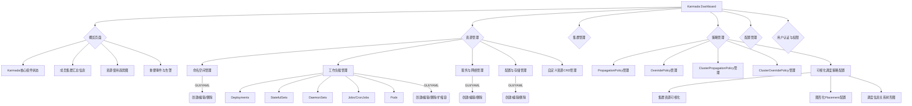

# 产品需求文档 (PRD) - Karmada-Manager 用户体验优化

## 1. 文档信息

### 1.1 版本历史

| 版本号 | 日期       | 作者 | 变更说明                     |
| ------ | ---------- | ---- | ---------------------------- |
| 1.0    | (今天日期) | Gemini | 初稿，聚焦概览和资源管理优化 |

### 1.2 文档目的

本文档旨在明确 Karmada-Manager (特别是 Karmada-Dashboard) 用户体验优化项目的产品需求，包括功能需求、非功能需求、用户场景、设计指导等，为后续的产品设计、研发、测试和上线提供依据和指导。

### 1.3 相关文档引用

- `docs/design/overwrite-karmada-dashboard.md` (Karmada Dashboard 重构设计文档)
- `docs/proposal/web-terminal-for-karmada-dashboard/READMD.md` (Karmada Dashboard Web Terminal 提案)
- `docs/i18n-docs.md` (Automation tools for i18n and translate)
- (其他相关项目文档或设计规范)

## 2. 产品概述

### 2.1 产品名称与定位

- **产品名称**: Karmada-Manager (特指其 Karmada-Dashboard 组件)
- **产品定位**: 为 Karmada 用户提供一个直观、高效、用户友好的图形化管理界面，简化多集群管理和应用分发的复杂度，提升整体运营效率和用户体验。

### 2.2 产品愿景与使命

- **产品愿景**: 成为业界领先的 Karmada 可视化管理平台，提供极致的用户体验。
- **产品使命**: 通过持续优化 Dashboard 功能和交互，降低 Karmada 的使用门槛，赋能用户轻松管理大规模多云环境。

### 2.3 价值主张与独特卖点 (USP)

- **价值主张**:
    - **提升易用性**: 通过更直观的概览和表单化的资源管理，降低用户学习成本和操作复杂度。
    - **增强洞察力**: 提供更丰富的集群和资源状态信息，帮助用户快速做出决策。
    - **提高效率**: 优化核心操作流程，减少用户在重复性任务上的时间投入。
- **独特卖点**:
    - **Karmada 原生体验**: 深度集成 Karmada 特性，提供最佳的兼容性和功能支持。
    - **可视化多集群管理**: 专为多集群场景优化，简化跨集群资源和策略的管理。

### 2.4 目标平台列表

- **Web**: Karmada-Dashboard 主要通过 Web 浏览器访问。

### 2.5 产品核心假设

- 用户期望通过 Dashboard 更轻松地理解 Karmada 控制面和成员集群的整体状态。
- 用户期望通过表单等更友好的方式创建和管理 Kubernetes 资源，而不仅仅是 YAML 编辑。
- 优化后的 Dashboard 能显著提升用户对 Karmada 的满意度和使用意愿。

### 2.6 商业模式概述 (如适用)

- 开源项目，主要目标是提升 Karmada 生态的用户体验和社区活跃度。

## 3. 用户研究

### 3.1 目标用户画像 (详细)

#### 3.1.1 用户画像1: Kubernetes/Karmada 管理员 (王明)

- **人口统计特征**: 30-45岁，男性居多，一线或新一线城市，拥有计算机相关学位。
- **行为习惯与偏好**:
    - 每天花费大量时间在集群监控、故障排查、资源配置和策略管理上。
    - 熟悉 `kubectl` 和 YAML，但对于重复性操作或快速概览场景，更倾向于高效的 GUI。
    - 关注告警、资源利用率、集群健康度等核心指标。
    - 喜欢可定制化、信息密度高的 Dashboard。
- **核心需求与痛点**:
    - **需求**: 快速了解 Karmada 及所有成员集群的宏观状态；便捷地管理成员集群生命周期；高效配置和调整资源分发策略和差异化策略；简化应用在多集群的部署和管理流程；快速定位和诊断问题。
    - **痛点**: 当前概览页信息过于简单，无法快速掌握全局状态；资源管理完全依赖 YAML，对于不熟悉或临时需要创建简单资源的用户不友好，效率较低；跨集群问题排查链路长。
- **动机与目标**: 确保 Karmada 控制面和所有纳管集群的稳定、高效运行；快速响应业务部门的资源需求；优化资源利用率，降低成本。

#### 3.1.2 用户画像2: 应用开发者/DevOps 工程师 (李娜)

- **人口统计特征**: 25-35岁，性别均衡，对新技术有较高接受度。
- **行为习惯与偏好**:
    - 关注应用的部署状态、资源消耗、日志和事件。
    - 可能不如管理员深入了解 Karmada 底层机制，但需要使用 Karmada进行应用的多集群部署和管理。
    - 偏好图形化界面进行资源申请、状态查看和简单变更。
- **核心需求与痛点**:
    - **需求**: 方便地将应用部署到指定的集群或集群组；清晰地查看应用在各集群的运行状态；简单修改应用配置（如副本数、镜像版本）；了解应用相关的策略配置。
    - **痛点**: 纯 YAML 方式部署和管理应用有一定门槛，尤其是在需要快速迭代或不熟悉 Karmada 策略配置时；难以直观理解应用的分发逻辑和最终状态。
- **动机与目标**: 快速、可靠地将应用交付到多集群环境；确保应用的高可用性和良好性能；简化日常的应用运维工作。

### 3.2 用户场景分析

#### 3.2.1 核心使用场景详述

**场景1: 管理员每日巡检 Karmada 健康状况**

- **用户故事**: 作为一名 Karmada 管理员，我想要在概览页面快速了解 Karmada 控制面状态、成员集群的整体健康度、关键资源（CPU、内存、存储）的总体使用情况以及重要的告警信息，以便我能及时发现潜在风险并采取行动。
- **当前痛点**: 现有概览页信息不足，需要跳转多个页面或使用命令行才能获取全面信息。
- **优化期望**: 概览页提供更丰富、更集中的状态展示和关键指标。

**场景2: 管理员快速添加一个新的成员集群**

- **用户故事**: 作为一名 Karmada 管理员，我想要通过 Dashboard 界面引导式地完成新成员集群的注册流程，包括集群基本信息填写、选择加入方式（Push/Pull）、配置访问凭证等，以便我能快速扩展 Karmada 的管理范围。
- **当前痛点**: （假设当前主要依赖命令行或已有流程）图形化引导不足。
- **优化期望**: 提供清晰的表单和步骤指引，简化集群注册。

**场景3: 应用开发者通过 Dashboard 部署一个新应用**

- **用户故事**: 作为一名应用开发者，我想要通过 Dashboard 的表单引导方式创建一个 Deployment 资源，并指定其副本数、容器镜像、端口等基本信息，同时选择或创建一个简单的 PropagationPolicy 将其部署到开发环境的成员集群，以便我能快速验证我的应用。
- **当前痛点**: 只能使用 YAML 创建资源，对不熟悉 Kubernetes 或 Karmada 的开发者不友好，容易出错。
- **优化期望**: 提供常用资源的表单化创建和编辑界面，并能关联创建或选择已有策略。

**场景4: 管理员查看并调整一个应用的副本数**

- **用户故事**: 作为一名 Karmada 管理员，我想要在 Dashboard 上找到一个特定的 Deployment 资源，查看其在各个成员集群的实际副本数和期望副本数，并能通过图形界面快速调整其总体副本数或针对特定集群的差异化配置，以便我能应对流量变化或进行故障恢复。
- **当前痛点**: 查看分散，调整依赖 YAML 或多条命令。
- **优化期望**: 集中展示资源在各集群状态，提供便捷的修改入口。

**场景5: 管理员通过可视化界面配置和优化资源调度策略**

- **用户故事**: 作为一名Karmada管理员，我想要通过图形化界面直观地查看各成员集群的资源容量与负载情况，并通过拖拽或表单配置方式创建和调整调度策略（如PropagationPolicy的`placement`部分，或者更高级的调度算法参数），以便我能更高效、更智能地分配和调度多集群资源，确保应用性能和资源利用率最优化。
- **当前痛点**: 调度策略（特别是`PropagationPolicy`中的`placement`）主要依赖YAML编写，对于复杂的调度规则（如集群亲和性、污点容忍、资源权重分配等）不够直观，难以快速验证和调整。
- **优化期望**: 提供可视化的集群资源视图和图形化的策略配置工具，简化调度策略的创建和管理，提供调度结果的模拟或预览。

#### 3.2.2 边缘使用场景考量

- 用户在弱网环境下访问 Dashboard。
- 用户在高权限和低权限账户下看到的内容和可操作项的差异。
- 同时管理大量（如上百个）成员集群时的性能和UI呈现。

### 3.3 用户调研洞察 (如适用)

- （此部分可在后续迭代中通过用户访谈、问卷调查等方式填充）
- 初步洞察：用户普遍认为 Karmada 功能强大，但在可视化管理和易用性方面有较大提升空间。

## 4. 市场与竞品分析

### 4.1 市场规模与增长预测

- Kubernetes 已成为容器编排的事实标准，多集群管理是其发展的必然趋势。
- Karmada 作为优秀的开源多集群管理方案，其用户群和市场潜力持续增长。
- 优秀的可视化 Dashboard 是提升用户采纳率和社区活跃度的关键因素。

### 4.2 行业趋势分析

- **声明式 API 优先**: Dashboard 应遵循 Kubernetes 和 Karmada 的声明式API设计理念。
- **可视化与可观测性增强**: 用户期望通过图表、拓扑等方式更直观地理解系统状态。
- **智能化与自动化**: 未来可探索基于 AI 的异常检测、智能调度建议等。
- **安全性内置**: 安全是多集群管理的重中之重，Dashboard 设计需充分考虑权限控制和安全审计。

### 4.3 竞争格局分析

#### 4.3.1 直接竞争对手详析

- **Rancher**: 提供强大的多 Kubernetes 集群管理功能，UI 成熟度高，功能全面。
    - 优势: 用户体验好，生态完善，内置应用商店等。
    - 劣势: 相对较重，对于仅需 Karmada 核心功能的用户可能过于复杂。
- **Kubernetes Dashboard (原生)**: 提供单个集群的可视化管理。
    - 优势: 轻量，官方出品。
    - 劣势: 不直接支持多集群管理，功能相对基础。
- **其他云厂商的多集群管理控制台 (如 ACK One, GKE Hub, EKS Anywhere Console)**:
    - 优势: 与自家云生态深度集成。
    - 劣势: 通常有厂商锁定，通用性不如 Karmada。

#### 4.3.2 间接竞争对手概述

- Lens, K9s 等本地 Kubernetes IDE/Dashboard 工具：提供强大的本地管理体验，但非 Web 化，协作性不足。

### 4.4 竞品功能对比矩阵

| 功能点             | Karmada-Dashboard (优化后) | Rancher | K8s Dashboard | Lens/K9s |
| ------------------ | ---------------------------- | ------- | ------------- | -------- |
| **概览页信息丰富度** | ★★★★☆                        | ★★★★★   | ★★☆☆☆         | ★★★☆☆    |
| **多集群统一视图**   | ★★★★★                        | ★★★★★   | ★☆☆☆☆         | ★★★☆☆    |
| **资源可视化创建** | ★★★★☆                        | ★★★★★   | ★★★☆☆         | ★★★★☆    |
| **Karmada策略管理**| ★★★★★                        | ☆☆☆☆☆   | ☆☆☆☆☆         | ☆☆☆☆☆    |
| **用户体验友好度** | ★★★★☆                        | ★★★★☆   | ★★★☆☆         | ★★★★☆    |
| **轻量化**         | ★★★★☆                        | ★★☆☆☆   | ★★★★★         | ★★★★★    |

### 4.5 市场差异化策略

- **聚焦 Karmada 核心能力**: 深度整合 Karmada 的 PropagationPolicy, OverridePolicy, Cluster API 等，提供最佳原生体验。
- **轻量与高效**: 保持相对轻量，专注于核心管理功能，避免过度臃肿。
- **开放与可扩展**: 保持良好的扩展性，便于社区贡献和第三方插件集成。

## 5. 产品功能需求

### 5.1 功能架构与模块划分



### 5.2 核心功能详述

#### 5.2.1 概览页面 (Overview Page) 增强

- **功能描述**: 提供一个集中、丰富、直观的全局视图，展示 Karmada 控制面和所有成员集群的核心状态和关键指标。
- **用户价值**: 帮助管理员快速了解系统整体健康状况，及时发现潜在问题，提升监控效率。
- **功能逻辑与规则**:
    - **Karmada 控制面信息**:
        - 显示 Karmada API Server, Controller Manager, Scheduler 等核心组件的健康状态（如运行中、异常）。
        - 显示 Karmada 版本信息。
        - 显示 Karmada 控制面集群的创建时间或运行时长。
    - **成员集群汇总信息**:
        - **集群数量统计**: 总集群数、健康集群数、异常集群数、未就绪集群数。可点击数字跳转到集群管理列表并进行筛选。
        - **节点汇总**: 所有成员集群的节点总数、Ready 节点总数。
        - **资源汇总 (成员集群)**:
            - CPU 总容量、已分配量、使用量（可选，可能需要 metrics-server 支持）。
            - Memory 总容量、已分配量、使用量（可选）。
            - Pod 总容量、已分配量。
        - 以统计卡片或小型图表形式展示。
    - **资源使用趋势 (可选，依赖监控数据)**:
        - CPU/Memory/Pod 总体使用率随时间变化的趋势图 (例如过去1小时、6小时、24小时)。可考虑使用 Ant Design Charts。
    - **策略信息汇总**:
        - PropagationPolicy 总数，按状态（如 Succeeded, Failed）分类统计。
        - OverridePolicy 总数。
    - **多云资源信息汇总**:
        - 各类型（Deployment, StatefulSet, Service, Namespace 等）在 Karmada层面定义的资源数量。
    - **关键事件与告警**:
        - 显示最近的 N 条 Warning/Error级别的 Kubernetes 事件 (来自 Karmada 控制面及成员集群，需聚合)。
        - （未来）集成告警系统，展示活动告警。
    - **布局与交互**:
        - 采用卡片式布局，信息分区清晰。
        - 关键数据提供下钻能力，点击可跳转到相关详情页或列表页。
        - （未来）允许用户自定义概览页显示的模块和布局。
- **交互要求**:
    - 页面加载速度快，数据异步加载，避免长时间白屏。
    - 图表清晰易懂，有明确的图例和单位。
    - 响应式设计，适应不同屏幕尺寸。
- **数据需求**:
    - Karmada API Server 返回的集群、节点、Pod、Policy、各类资源对象等数据。
    - （可选）监控系统 (如 Prometheus) 采集的资源使用数据。
    - Kubernetes 事件数据。
- **技术依赖**:
    - Karmada API Client。
    - （可选）Metrics Scraper / Prometheus。
    - UI 框架 (如 Ant Design, Ant Design Charts)。
- **验收标准**:
    - **AC1.1**: 概览页正确显示 Karmada 控制面核心组件状态和版本。
    - **AC1.2**: 概览页正确汇总并显示成员集群的数量（总数、健康、异常等）和节点数量（总数、Ready）。
    - **AC1.3**: 概览页正确汇总并显示成员集群的 CPU、Memory、Pod 的分配情况和（若支持）使用率。
    - **AC1.4**: 概览页正确显示 PropagationPolicy 和 OverridePolicy 的总数。
    - **AC1.5**: 概览页正确显示在 Karmada 中定义的各类资源（如 Deployment, Namespace）的数量。
    - **AC1.6**: 概览页能展示最近的 Kubernetes Warning/Error 事件。
    - **AC1.7**: （若实现趋势图）CPU/Memory/Pod 使用趋势图能正确渲染，并可选择时间范围。
    - **AC1.8**: 关键统计数字具有下钻链接，能正确跳转到相应列表页并应用筛选。
    - **AC1.9**: 页面布局合理，信息清晰，在主流浏览器上显示正常。

#### 5.2.2 资源管理 (Resource Management) 优化 - GUI 创建/编辑

- **功能描述**: 针对常用的 Kubernetes 资源 (如 Deployment, StatefulSet, Service, ConfigMap, Secret, Namespace 等)，提供表单化、引导式的创建和编辑界面，同时保留 YAML 编辑模式作为高级选项。
- **用户价值**: 降低普通用户和初级开发者使用 Karmada 管理资源的门槛，提高配置效率，减少因手动编写 YAML 带来的错误。
- **功能逻辑与规则**:
    - **支持的资源类型**:
        - **P0 (首期实现)**: Namespace, Deployment, Service (ClusterIP, NodePort, LoadBalancer), ConfigMap, Secret。
        - **P1 (后续迭代)**: StatefulSet, DaemonSet, Job, CronJob, Ingress, PersistentVolumeClaim。
    - **通用操作**:
        - **列表视图**: 显示资源列表，关键信息列（名称、状态、Namespace、创建时间、关联的 PropagationPolicy/OverridePolicy 简要信息等），支持搜索、筛选、分页。
        - **创建操作**:
            - 提供 "创建资源" 按钮，用户可选择通过 "表单创建" 或 "YAML 创建"。
            - **表单创建**:
                - 根据资源类型动态生成表单字段。
                - 表单包含常用必填项和可选高级配置项。
                - 字段提供输入校验和提示信息。
                - 对于 Namespace，可以提示用户是否自动创建默认的 PropagationPolicy (如全集群分发)。
                - 对于工作负载，需关联选择或创建 PropagationPolicy。可考虑简化 PropagationPolicy 的创建流程，例如提供预设模板（全集群、按标签选择等）。
                - 可引导用户选择或创建 OverridePolicy (可选)。
            - **YAML 创建**: 提供 YAML 编辑器，支持语法高亮、格式化、校验。
        - **编辑操作**:
            - 用户可选择通过 "表单编辑" 或 "YAML 编辑"。
            - 表单编辑时，加载现有资源数据填充表单。
            - YAML 编辑时，加载现有资源的 YAML 内容。
        - **查看详情**: 展示资源的详细信息、状态、关联对象（如 Pods for Deployment）、事件、YAML 定义。
        - **删除操作**: 支持单个或批量删除。
    - **特定资源逻辑**:
        - **Deployment/StatefulSet/DaemonSet**:
            - 表单支持配置副本数、容器镜像、端口、环境变量、卷挂载（简化版）、探针（简化版）、标签、注解等。
            - 详情页展示 Pod 列表及状态，支持查看 Pod 日志、进入 Pod 终端 (依赖 Web Terminal 功能)。
            - 支持一键扩缩容。
        - **Service**:
            - 表单支持选择 Service 类型、端口映射、选择器等。
        - **ConfigMap/Secret**:
            - 表单支持添加键值对数据。Secret 数据输入时应做掩码处理或提示安全风险。
    - **与策略的关联**:
        - 创建或编辑资源时，清晰展示和管理其关联的 PropagationPolicy 和 OverridePolicy。
        - 提供快捷创建或选择已有策略的入口。
- **交互要求**:
    - 表单设计清晰、易于理解，重要选项突出。
    - 复杂配置项可折叠或分组。
    - YAML 编辑器体验良好。
    - 在表单和 YAML 模式间切换时，尽可能保持数据一致性（如果可以转换）。
- **数据需求**:
    - Kubernetes 各种资源对象的 Schema 定义。
    - 用户输入的表单数据。
    - 资源的实时状态和事件。
- **技术依赖**:
    - Karmada API Client。
    - UI 框架 (如 Ant Design)。
    - YAML 编辑器组件 (如 Monaco Editor)。
- **验收标准**:
    - **AC2.1**: 用户可以通过表单成功创建、查看、编辑和删除 Namespace 资源。
    - **AC2.2**: 用户可以通过表单成功创建、查看、编辑和删除 Deployment 资源（包括副本数、镜像、端口等核心字段）。
    - **AC2.3**: 用户可以通过表单成功创建、查看、编辑和删除 Service 资源（包括类型、端口映射、选择器等核心字段）。
    - **AC2.4**: 用户可以通过表单成功创建、查看、编辑和删除 ConfigMap 和 Secret 资源（包括键值对数据）。
    - **AC2.5**: 对于以上操作，均提供对应的 YAML 创建/编辑入口，功能正常。
    - **AC2.6**: 创建资源时，可以引导用户关联或创建 PropagationPolicy。
    - **AC2.7**: 资源列表页能够正确展示资源的关键信息，并支持搜索和分页。
    - **AC2.8**: 资源详情页能够正确展示资源的详细信息、状态、关联对象和 YAML。
    - **AC2.9**: 表单字段包含必要的校验和提示。

#### 5.2.3 可视化资源调度与策略创建

- **功能描述**: 为管理员提供一个可视化的界面，用于查看成员集群的资源状态、负载情况，并能通过图形化方式创建和配置资源调度策略（主要是`PropagationPolicy`的`placement`以及未来可能的`SchedulingPolicy`或类似CRD）。
- **用户价值**: 显著降低理解和配置Karmada复杂调度策略的门槛，提高资源调度的效率和准确性，优化资源在多集群间的分配。
- **功能逻辑与规则**:
    - **集群资源可视化**:
        - 以卡片、列表或拓扑图形式展示各成员集群的实时/准实时资源容量（CPU, Memory, GPU等）、已分配量、剩余量、节点数、健康状态。
        - 可按区域、标签等对集群进行分组和筛选展示。
        - 提供集群负载指示器（如颜色编码或百分比显示负载高低）。
        - 显示集群的标签 (Labels) 和污点 (Taints) 信息。
    - **图形化 PropagationPolicy `placement` 配置**:
        - **目标集群选择**:
            - 允许用户通过在可视化集群列表中点选、勾选目标集群。
            - 支持基于集群名称、标签 (ClusterSelector) 进行动态选择。
            - 支持配置集群亲和性 (`clusterAffinity`) 和反亲和性规则。
        - **副本调度策略 (`replicaScheduling`)**:
            - 图形化配置副本分配策略，如 `Duplicated` (复制到所有选定集群) 或 `Divided` (按权重或请求的副本数在选定集群间分配)。
            - 对于 `Divided` 策略，支持配置权重分配或指定各集群的副本数。
        - **分发约束 (`spreadConstraints`)**:
            - 引导用户配置基于集群拓扑域（如`karmada.io/region`, `karmada.io/zone`）的副本打散约束。
            - 允许用户指定 `maxSkew`, `minGroups` (如果适用)。
        - **污点容忍 (`tolerations`)**:
            - 允许用户通过表单添加工作负载对特定集群污点的容忍配置。
    - **（未来）高级调度策略配置 (如与 `SchedulingPolicy` CRD 集成)**:
        - 图形化配置调度器参数、权重、优先级等。
        - 图形化配置应用的重调度策略。
    - **调度模拟/预览 (可选，P2或更高)**:
        - 在应用策略前，基于当前集群状态和所选策略，模拟一个典型工作负载（如指定资源请求的Deployment）可能的调度结果（例如，哪些集群会被选中，副本如何分布）。
    - **与资源创建/编辑流程集成**:
        - 在创建/编辑工作负载时，用户可以从传统的YAML或简单表单方式切换到/打开此可视化调度配置界面来定义或修改其`PropagationPolicy`的`placement`部分。
        - 修改后的策略可以直接应用或保存为新的`PropagationPolicy`。
- **交互要求**:
    - 界面直观，易于理解集群资源分布和负载，策略配置与集群视图能有效联动。
    - 点选、勾选、表单填写等操作流畅、响应及时。
    - 复杂的配置项（如亲和性规则、蔓延约束）提供清晰的说明、示例或引导式配置。
    - 提供策略配置的实时预览或摘要信息。
    - 从资源编辑跳转到可视化调度配置，再返回时，应能保持上下文连贯。
- **数据需求**:
    - 各成员集群的详细资源数据 (capacity, allocatable, usage - 依赖metrics-server/scraper)。
    - Cluster API 对象 (特别是 `status.conditions`, `status.nodeSummary`, `spec.taints`, `metadata.labels`)。
    - Node API 对象 (用于更细致的节点状态和资源，但可能数据量较大，需考虑性能)。
    - `PropagationPolicy` CRD schema (特别是 `spec.placement` 部分)。
    - （未来）`SchedulingPolicy` 或其他调度相关CRD schema。
- **技术依赖**:
    - Karmada API Client。
    - UI 框架 (Ant Design)。
    - 可视化图表/组件 (Ant Design Charts, 或其他适用于列表、卡片、简单拓扑展示的组件)。
    - Metrics Scraper / Prometheus (用于实时集群资源和负载数据)。
- **验收标准**:
    - **AC3.1**: 用户可以在可视化界面中清晰查看各成员集群的名称、状态、标签、污点、资源容量（CPU/Mem）、已分配资源（CPU/Mem）和健康状态。集群列表支持按名称、标签筛选。
    - **AC3.2**: 用户可以通过图形化方式（如点选列表项、填写表单）配置`PropagationPolicy`的`placement.clusterAffinity`（包括`clusterNames`直接选择）和`placement.clusterSelector`（基于标签选择）。
    - **AC3.3**: 用户可以通过图形化方式为`PropagationPolicy`的`placement`配置`spreadConstraints`（至少支持一个约束条件的添加和配置）。
    - **AC3.4**: 用户可以通过图形化方式为`PropagationPolicy`的`placement`配置`tolerations`。
    - **AC3.5**: 在创建/编辑工作负载时，用户可以跳转到可视化调度配置界面，完成`PropagationPolicy`的`placement`配置，并将生成的策略片段正确应用回工作负载关联的`PropagationPolicy`。
    - **AC3.6**: 可视化界面能正确反映集群的标签和污点信息，辅助策略配置。
    - **AC3.7**: （若实现`replicaScheduling`的图形化配置）用户可以图形化配置`Duplicated`和`Divided`（至少支持按权重）策略。
    - **AC3.8**: （若实现预设模板）用户可以从预设的调度策略模板（例如，"所有集群"、"指定区域集群"）中选择并应用。

#### 5.2.4 调度信息关系树形图展示 (新增)

- **功能描述**: 为用户提供一个以关系树形图的方式可视化特定`PropagationPolicy`的调度逻辑的功能。该视图将清晰地展示策略的组成部分、应用的规则以及这些规则如何最终指向目标集群。**此树形图专注于调度信息，不展示非调度相关的资源本身。**
- **用户价值**: 帮助用户更深入地理解复杂调度策略的结构和决策路径，快速定位特定调度规则如何影响集群选择，提升策略配置的透明度和可调试性。
- **功能逻辑与规则**:
    - **触发方式**: 用户可以在查看`PropagationPolicy`详情时，选择进入"调度关系树视图"。
    - **树形图结构**:
        - **根节点**: `PropagationPolicy` 名称。
        - **一级子节点 (策略核心组件)**:
            - `Placement`
        - **二级子节点 (Placement规则类型)**: 从 `Placement` 展开，展示其下的核心规则模块，如：
            - `ClusterAffinity` (或 `ClusterSelector`)
            - `SpreadConstraints` (若定义)
            - `Tolerations` (若定义)
            - `ReplicaScheduling` (若定义)
        - **三级及后续子节点 (规则详情与目标集群)**:
            - **`ClusterAffinity` / `ClusterSelector` 下**:
                - 显示具体的 `clusterNames` 列表（作为叶子节点或可进一步展开显示集群调度相关信息）。
                - 显示 `labelSelector` 的匹配规则，并列出动态匹配到的目标集群列表。
            - **`SpreadConstraints` 下**:
                - 每个约束条件作为子节点。
                - 展开约束条件可显示 `topologyKey`, `maxSkew`, `minGroups` (如果适用), `whenUnsatisfiable`。
                - (可选) 关联展示符合该拓扑域的集群组。
            - **`Tolerations` 下**:
                - 每个 `toleration` 规则 (`key`, `operator`, `value`, `effect`) 作为子节点。
                - (可选) 关联展示带有对应污点的集群，并标明是否被容忍。
            - **`ReplicaScheduling` 下**:
                - 显示策略类型 (`Duplicated` / `Divided`)。
                - 若为 `Divided`，可展示权重分配规则或各集群的副本数指定，并指向目标集群。
        - **集群节点信息**: 当树形图节点代表一个具体的成员集群时，点击或悬浮该集群节点，可以显示其与调度相关的关键摘要信息，例如：
            - 集群名称。
            - 与当前策略相关的标签。
            - 集群的污点。
            - 当前资源容量/负载简报。
            - (如果适用且可计算) 当前策略下，预计调度到此集群的副本数或权重。
    - **视图特性**:
        - 只展示与当前`PropagationPolicy`调度逻辑直接相关的信息。
        - 清晰标示规则如何层层过滤/指向最终的目标集群。
        - 对于未定义或不适用的规则模块（如没有配置`SpreadConstraints`），则不展示相应分支。
- **交互要求**:
    - 用户可以方便地展开和折叠树形图的各个节点。
    - 视图应清晰易读，层级关系明确。
    - 点击集群节点时，能快速预览其调度相关属性。
    - （可选）提供搜索功能，快速定位树中的特定集群或规则。
    - （可选）提供高亮路径功能：例如，选中一个目标集群，树形图上高亮显示导致该集群被选中的所有规则路径。
- **数据需求**:
    - `PropagationPolicy` 对象的完整定义。
    - 所有成员集群的 `Cluster` API 对象 (特别是 `metadata.labels`, `spec.taints`, `status.resourceSummary` 或类似信息)。
    - （用于`ReplicaScheduling`的`Divided`策略）可能需要了解各集群的权重配置或期望副本数。
- **技术依赖**:
    - Karmada API Client。
    - UI 框架 (Ant Design) 及其 Tree 组件或专门的树形图可视化库 (如 G6, ECharts Tree)。
- **验收标准**:
    - **AC4.1**: 用户可以从 `PropagationPolicy` 详情页触发并正确显示调度关系树形图。
    - **AC4.2**: 树形图的根节点正确显示 `PropagationPolicy` 名称。
    - **AC4.3**: 树形图能正确展示 `Placement` 下的 `ClusterAffinity` (或 `ClusterSelector`) 规则，并列出其直接或间接指向的目标集群。
    - **AC4.4**: (若定义) 树形图能正确展示 `SpreadConstraints` 规则及其详细配置。
    - **AC4.5**: (若定义) 树形图能正确展示 `Tolerations` 规则及其详细配置。
    - **AC4.6**: (若定义) 树形图能正确展示 `ReplicaScheduling` 规则及其详细配置和目标集群。
    - **AC4.7**: 点击或悬浮集群节点时，能显示该集群的调度相关摘要信息（标签、污点、资源等）。
    - **AC4.8**: 树形图节点支持展开和折叠操作。
    - **AC4.9**: 树形图只包含与当前 `PropagationPolicy` 调度逻辑相关的信息，不展示无关内容。

### 5.3 次要功能描述

- **Web Terminal 增强集成**: 在 Pod 列表、Node 列表等处提供更方便的 Web Terminal 入口。
- **操作审计日志 (初步)**: 关键操作（如资源创建删除、策略变更）能在后端留下审计记录，为后续审计功能打基础。

### 5.4 未来功能储备 (Backlog)

- **更完善的 RBAC 与多租户支持**: 细粒度的权限控制，支持多租户隔离。
- **应用维度的管理视图**: 将 Deployment, Service, Ingress 等聚合为"应用"进行管理。
- **Helm Chart 管理**: 支持通过 UI 管理 Helm Release。
- **自定义概览仪表盘**: 允许用户自定义概览页展示的组件和布局。
- **可视化策略编辑器**: 通过图形化方式构建复杂的 PropagationPolicy 和 OverridePolicy。
- **成本分析与优化建议**: （远期）结合监控数据进行多集群成本分析。

## 6. 用户流程与交互设计指导

### 6.1 核心用户旅程地图

**旅程1: 管理员首次登录并查看系统状态**

1.  **登录页**: 输入凭证。
2.  **跳转概览页**:
    - **感知**: 看到 Karmada 状态、集群汇总、资源汇总、告警等卡片。
    - **思考**: 系统是否健康？哪些集群有问题？资源是否充足？
    - **行动**: 点击异常集群数量，跳转到集群列表页查看。
    - **体验**: 信息获取快速、直接。

**旅程2: 开发者部署新应用到测试集群**

1.  **导航至资源管理**: 选择 "Workload" -> "Deployments"。
2.  **点击 "创建 Deployment"**: 选择 "表单创建"。
3.  **填写表单**: 输入应用名称、镜像、副本数等。
4.  **配置分发策略**:
    - **选项1 (简单)**: 选择预设的 "分发到测试集群组" PropagationPolicy。
    - **选项2 (自定义)**: 点击 "新建 PropagationPolicy"，简单配置指定测试集群。
5.  **提交创建**:
    - **感知**: 看到 Deployment 创建成功，状态为 "Creating" 或 "Propagating"。
    - **行动**: 跳转到 Deployment 详情页，查看其在各集群的 Pod 状态。
    - **体验**: 无需编写 YAML，流程顺畅。

**旅程3: 管理员通过可视化界面优化应用A的调度策略**

1.  **导航至资源管理/策略管理**: 找到应用A关联的 `PropagationPolicy` 或直接从应用A的详情页进入其调度策略配置。
2.  **进入可视化调度配置界面**:
    - **感知**: 看到当前成员集群的资源概况（如哪些集群负载高、哪些有可用资源），以及应用A当前应用的调度规则。
    - **思考**: 当前调度策略是否最优？是否需要将应用A的某些副本迁移到更空闲或更合适的集群？
3.  **调整调度规则**:
    - 例如，通过点选从高负载集群中移除，添加到新的低负载集群。
    - 例如，修改`spreadConstraints`使其在更多可用区分布。
4.  **预览/保存策略**:
    - **行动**: （若有预览）查看调整后的模拟调度结果。确认无误后保存`PropagationPolicy`。
    - **感知**: 看到策略更新成功，Karmada开始根据新策略调度应用A。
    - **体验**: 策略调整直观、高效，能辅助做出更优的调度决策。

### 6.2 关键流程详述与状态转换图

**流程: 通过表单创建 Deployment**

```mermaid
graph TD
    A[用户进入Deployments列表页] --> B{点击 "创建Deployment"};
    B -- "选择表单创建" --> C[显示Deployment创建表单];
    C --> D{填写应用基本信息 (名称, Namespace, 镜像, 副本数...)};
    D --> E{配置容器信息 (端口, 环境变量, 卷...)};
    E --> F{配置分发策略 (选择已有PP/新建PP)};
    F -- "选择已有PP" --> G[选择一个PropagationPolicy];
    F -- "新建PP" --> H[弹出简易PP创建表单 (指定集群/标签)];
    H --> I[保存新PP];
    G --> J[关联PP到Deployment];
    I --> J;
    J --> K{提交创建请求};
    K -- 成功 --> L[Deployment进入创建中/分发中状态];
    K -- 失败 --> M[提示错误信息];
    L --> N[跳转到Deployment详情页或返回列表];
```

**流程: 通过可视化界面配置PropagationPolicy的Placement**

```mermaid
graph TD
    subgraph 工作负载编辑/创建流程
        P0[用户在工作负载表单] --> P1{点击"配置分发策略(可视化)"};
    end
    subgraph PropagationPolicy直接编辑流程
        S0[用户进入PP列表/详情页] --> S1{点击"可视化编辑Placement"};
    end

    P1 --> VSC[进入可视化调度配置页];
    S1 --> VSC;

    VSC --> VSC1{显示集群列表/视图 (含资源状态、标签、污点)};
    VSC1 --> VSC2{用户选择目标集群 (点选/按标签)};
    VSC2 --> VSC3{用户配置集群亲和性/反亲和性};
    VSC3 --> VSC4{用户配置副本调度方式 (Duplicated/Divided)};
    VSC4 --> VSC5{用户配置Spread Constraints};
    VSC5 --> VSC6{用户配置Tolerations};
    VSC6 --> VSC7[生成PropagationPolicy Placement片段];
    
    subgraph 返回工作负载流程
        VSC7 --> P2[返回工作负载表单];
        P2 --> P3[将Placement片段填充/更新到关联PP];
        P3 --> P4{保存工作负载和PP};
    end
    
    subgraph 直接保存PropagationPolicy流程
        VSC7 --> S2[更新当前PP的Placement];
        S2 --> S3{保存PropagationPolicy};
    end

    P4 -- 成功 --> P5[提示成功，返回列表/详情];
    P4 -- 失败 --> P6[提示错误];
    S3 -- 成功 --> S4[提示成功，返回列表/详情];
    S3 -- 失败 --> S5[提示错误];
```

### 6.3 对设计师 (UI/UX Agent) 的界面原型参考说明和要求

- **整体风格**: **在遵循 Ant Design 设计语言的基础上，追求更现代化、更美观、更具吸引力的视觉风格。** 保持专业性，同时提升界面的精致度和友好度。参考现有项目UI，但需进行显著的视觉提升。
- **色彩与特效**: **大胆且合理地运用更丰富的色彩搭配** (需符合品牌调性和可访问性标准)，营造专业且不失活力的界面氛围。**适当引入平滑的过渡动画和细致的交互特效**，提升操作的流畅感和视觉愉悦度，避免生硬的跳转。
- **数据可视化**: **强化数据可视化表现力**，优先使用如 **Ant Design Charts** 等成熟图表库，确保图表类型选择恰当、信息传达清晰、交互友好、视觉美观。
- **概览页面**:
    - 参考业界优秀的 Dashboard 设计，如 Grafana, Datadog，但要针对 Karmada 特性进行定制，并融入现代化设计元素。
    - 使用卡片 (Card) 组件组织信息模块，卡片设计应更精致。
    - 数据可视化优先，多使用 Ant Design Charts (如迷你图、环形图、柱状图、趋势线图) 展示关键指标，图表应具有良好的视觉效果和交互性。
    - 突出显示异常状态和重要告警，可使用更醒目的视觉提示。
- **资源列表页**:
    - 表格 (Table) 列信息应可配置或根据用户习惯优化。表格样式和交互应更友好。
    - 提供强大的筛选和搜索功能，搜索框和筛选条件交互体验应顺畅。
    - "创建" 按钮应醒目，并清晰区分 "表单创建" 和 "YAML 创建"，按钮样式可更现代化。
- **资源表单页 (创建/编辑)**:
    - 使用 Ant Design 的 Form 组件，表单布局和元素间距应优化，提升易读性和易用性。
    - 必填项和常用项放在前面，高级选项可折叠或分 Step。
    - 输入提示和校验信息友好，校验反馈应即时且清晰。
    - 对于 YAML 编辑，嵌入功能完善的编辑器 (如 Monaco)，编辑器主题可选择更现代的样式。
- **一致性**: 保持不同页面和模块间的交互模式和视觉风格一致。
- **可访问性**: 严格考虑 WCAG 标准，确保色弱、视障用户也能较好使用。所有颜色和视觉元素的选择都必须通过可访问性校验。
- **国际化 (i18n)**: **所有新增的界面文本（包括按钮、标签、提示信息、图表内的文本等）必须支持国际化**。设计师在提供设计稿时，应预留文本空间弹性，并配合开发遵循项目已有的国际化流程和工具（参考 `docs/i18n-docs.md`）。

### 6.4 交互设计规范与原则建议

- **反馈及时**: 用户的每一个操作都应有明确、即时且符合预期的系统反馈（加载状态、成功提示、错误提示），**反馈动效应自然平滑**。
- **容错性**: 允许用户撤销操作或纠正错误（如表单填写错误）。
- **效率优先**: 减少不必要的点击和页面跳转，优化高频操作路径。
- **引导清晰**: 对复杂功能或不常用操作提供必要的引导和帮助文案，引导方式可更具交互性。
- **一致性**: 遵循 Ant Design 的交互规范，确保操作逻辑和视觉元素的一致性。
- **视觉吸引力与愉悦交互**: **在保证功能性的前提下，追求界面的视觉美感和操作的愉悦感**。通过合理的布局、色彩、图标、动效等元素，提升用户体验。

## 7. 非功能需求

### 7.1 性能需求

- **概览页加载**: 首次加载时间 < 5秒 (中等规模集群，如50个成员集群，每个集群10节点)。数据异步加载，骨架屏展示。
- **列表页加载**: 资源列表（如1000个Deployments）加载和翻页响应时间 < 2秒。
- **API 响应**: 后端 API 平均响应时间 < 500ms。
- **并发用户**: （根据实际部署规模定义）支持至少 N 个并发用户流畅使用。

### 7.2 安全需求

- **认证**: 集成 Karmada 的认证机制 (如 OIDC, Token)。
- **授权**: 严格遵循 Karmada 的 RBAC 权限模型，用户只能看到和操作其有权限的资源。
- **API 安全**: 所有 API 接口均需鉴权。
- **数据传输**: 敏感数据（如 Secret）在传输和展示时应做适当处理。
- **依赖库安全**: 定期扫描前端和后端依赖库，修复已知漏洞。

### 7.3 可用性与可访问性标准

- **易学性**: 新用户能够通过引导或少量文档快速上手核心功能。
- **易用性**: 用户能够高效、舒适地完成任务，减少操作错误。**界面应具有良好的视觉吸引力和现代感，提升用户的整体使用感受。**
- **可访问性**: 关键功能满足 WCAG 2.1 A 级标准，争取达到 AA 级。包括键盘导航、屏幕阅读器支持、足够的色彩对比度等。

### 7.4 合规性要求

- （根据项目具体部署环境和行业要求确定，如 GDPR, SOX 等）。

### 7.5 数据统计与分析需求 (埋点)

- **用户行为**:
    - 页面访问量 (PV) 和独立访客数 (UV) (概览页、各资源列表页、详情页)。
    - 功能使用频率 (如表单创建资源次数、YAML 创建资源次数、扩缩容操作次数)。
- **性能监控**:
    - 页面加载时间。
    - API 调用成功率和耗时。
- **错误监控**:
    - 前端 JS 错误。
    - 后端 API 错误。
- **目标**: 收集数据以度量用户体验改进效果，发现潜在问题，指导后续迭代。

## 8. 技术架构考量

### 8.1 技术栈建议

- **前端**:
    - 框架: React (与项目现有 `ui/apps/dashboard` 技术栈保持一致)。
    - UI 组件库: Ant Design (已在项目中广泛使用)。
    - 状态管理: (根据项目现有情况选择，如 Redux, Zustand, 或 React Context)。
    - 数据可视化: Ant Design Charts (项目已引入相关文档，**鼓励充分利用其能力提升可视化效果**)。
    - YAML 编辑器: Monaco Editor (提供类 VSCode 的编辑体验)。
    - **国际化**: **所有新增UI文本需严格遵循项目已有的国际化方案和工具（如 `docs/i18n-docs.md` 所述流程），配合 `i18next` 和相关脚本进行处理。**
- **后端 (API 服务)**:
    - 语言: Go (与项目现有 `cmd/api` 技术栈保持一致)。
    - Web 框架: Gin (已在项目中广泛使用)。
    - Kubernetes Client: `client-go` (与 Karmada 核心库一致)。

### 8.2 系统集成需求

- **Karmada API Server**: Dashboard 后端直接与 Karmada API Server 交互，获取和操作资源。
- **Metrics Scraper / Prometheus (可选)**: 如果概览页需要展示详细的资源使用趋势，则需要集成监控系统。
- **认证系统 (OIDC Provider等)**: 与 Karmada 配置的认证系统集成。

### 8.3 技术依赖与约束

- 必须兼容 Karmada 主版本的 API。
- 前端性能优化，特别是处理大量数据展示时。
- 后端 API 设计需遵循 RESTful 原则，提供清晰、高效的接口。

### 8.4 数据模型建议 (关键实体)

- **概览数据**: 后端聚合 KarmadaInfo, MemberClusterStatus, ClusterResourceStatus 等形成统一的概览数据结构。
- **资源对象**: 前后端均使用 Kubernetes 和 Karmada 定义的资源对象结构 (如 `appsv1.Deployment`, `policyv1alpha1.PropagationPolicy`)。
- **表单数据模型**: 前端需定义与 UI 表单对应的 Plain Old JavaScript Objects (POJOs)，并实现与 Kubernetes 资源对象的双向转换逻辑。

## 9. 验收标准汇总

### 9.1 功能验收标准矩阵

| 模块         | 功能点                                     | 验收标准 (参考 5.2 中 AC编号)   | 优先级 |
| ------------ | ------------------------------------------ | ------------------------------- | ------ |
| **概览页面** | Karmada 控制面信息                         | AC1.1                           | P0     |
|              | 成员集群汇总 (数量、节点)                  | AC1.2                           | P0     |
|              | 成员集群资源汇总 (CPU, Mem, Pod 分配)      | AC1.3                           | P0     |
|              | 策略信息汇总                               | AC1.4                           | P0     |
|              | 多云资源信息汇总                           | AC1.5                           | P0     |
|              | 关键事件展示                               | AC1.6                           | P0     |
|              | (可选) 资源使用趋势图                      | AC1.7                           | P1     |
|              | 关键数据下钻                               | AC1.8                           | P0     |
|              | 布局与兼容性                               | AC1.9                           | P0     |
| **资源管理** | Namespace 表单 CRUD                         | AC2.1                           | P0     |
|              | Deployment 表单 CRUD                        | AC2.2                           | P0     |
|              | Service 表单 CRUD                           | AC2.3                           | P0     |
|              | ConfigMap/Secret 表单 CRUD                  | AC2.4                           | P0     |
|              | YAML 创建/编辑入口                          | AC2.5                           | P0     |
|              | 资源创建时关联/创建 PropagationPolicy      | AC2.6                           | P0     |
|              | 资源列表功能 (展示、搜索、分页)            | AC2.7                           | P0     |
|              | 资源详情功能 (展示、状态、关联对象、YAML)  | AC2.8                           | P0     |
|              | 表单校验与提示                             | AC2.9                           | P0     |
|              | (后续) StatefulSet, DaemonSet 等表单 CRUD |                                 | P1     |
| **可视化资源调度与策略创建** | 集群资源可视化 (状态、资源、标签、污点)     | AC3.1                           | P1     |
|                           | 图形化配置 `placement.clusterAffinity` / `clusterSelector` | AC3.2                           | P1     |
|                           | 图形化配置 `placement.spreadConstraints`      | AC3.3                           | P1     |
|                           | 图形化配置 `placement.tolerations`            | AC3.4                           | P1     |
|                           | 与工作负载创建/编辑流程集成                  | AC3.5                           | P1     |
|                           | (若实现) 图形化配置 `replicaScheduling`    | AC3.7                           | P1/P2  |
|                           | (若实现) 使用预设调度策略模板                | AC3.8                           | P1/P2  |
| **调度信息关系树形图**      | 从策略详情页触发并正确显示树形图             | AC4.1                           | P2     |
|                           | 根节点正确显示策略名称                     | AC4.2                           | P2     |
|                           | 正确展示 ClusterAffinity/Selector 及目标集群 | AC4.3                           | P2     |
|                           | (若定义) 正确展示 SpreadConstraints        | AC4.4                           | P2     |
|                           | (若定义) 正确展示 Tolerations              | AC4.5                           | P2     |
|                           | (若定义) 正确展示 ReplicaScheduling        | AC4.6                           | P2     |
|                           | 集群节点显示调度摘要信息                   | AC4.7                           | P2     |
|                           | 节点支持展开/折叠                          | AC4.8                           | P2     |
|                           | 图内容仅含调度相关信息                     | AC4.9                           | P2     |

### 9.2 性能验收标准

- 概览页加载时间、列表页加载时间、API 响应时间满足 7.1 中定义的要求。

### 9.3 质量验收标准

- **Bug 密度**: (根据团队标准定义，如严重 Bug < X 个/KLOC)。
- **代码覆盖率**: (根据团队标准定义，如单元测试覆盖率 > X%)。
- **UI 兼容性**: 在最新版本的 Chrome, Firefox, Edge 浏览器上显示和功能正常。
- **文档完整性**: 用户文档、API 文档更新及时。

## 10. 产品成功指标

### 10.1 关键绩效指标 (KPIs) 定义与目标

- **用户活跃度提升**:
    - **DAU/MAU (日活/月活用户数)**: 较优化前提升 X%。
    - **平均会话时长**: 较优化前提升 Y%。
- **任务完成效率**:
    - **通过表单创建 Deployment 的平均耗时**: < Z 分钟。
    - **概览页问题发现率**: (通过用户调研或A/B测试衡量) 用户能通过概览页更快发现模拟问题的比例。
- **用户满意度**:
    - **NPS (净推荐值)**: 达到 N 分。
    - **用户调研反馈**: 正面评价占比 > P%。
- **资源创建方式占比**:
    - **通过表单创建资源的比例**: 达到 Q% (相比 YAML 创建)。

### 10.2 北极星指标定义与选择依据

- **北极星指标**: **Karmada-Dashboard 用户任务成功率和满意度**。
- **选择依据**: 该指标综合反映了 Dashboard 的易用性、效率和用户接受度，直接关联到提升 Karmada 整体用户体验的核心目标。任务成功率可以通过埋点数据分析，满意度可以通过NPS或调研获得。

### 10.3 指标监测计划

- **数据埋点**: 在前端和后端关键路径进行埋点，收集用户行为数据、性能数据和错误数据。
- **监控平台**: 使用合适的 APM (Application Performance Monitoring) 和用户行为分析工具。
- **报告频率**:
    - 核心 KPI 每周/每双周审视。
    - 详细数据分析报告每月输出。
- **反馈渠道**: 建立用户反馈渠道（如 GitHub Issues, 社区论坛），定期收集用户意见。

---
(文档结束) 