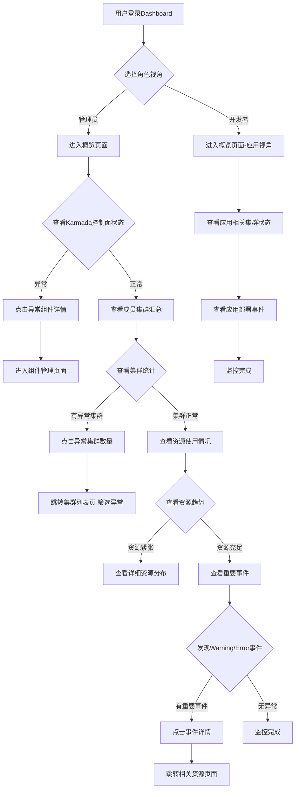
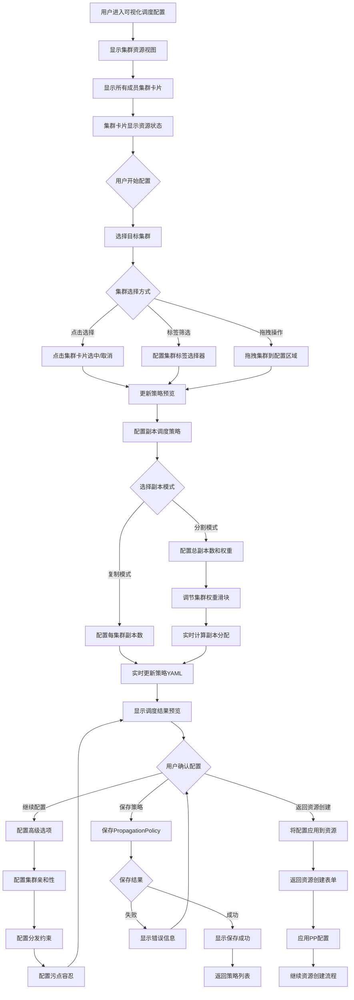
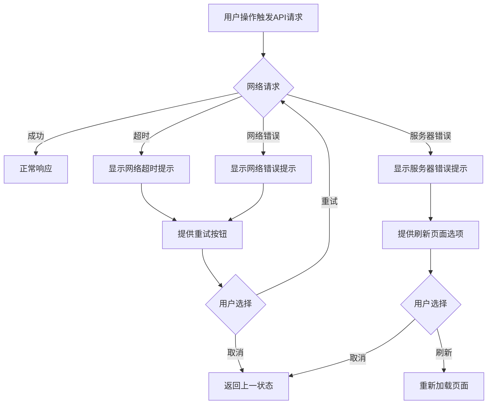
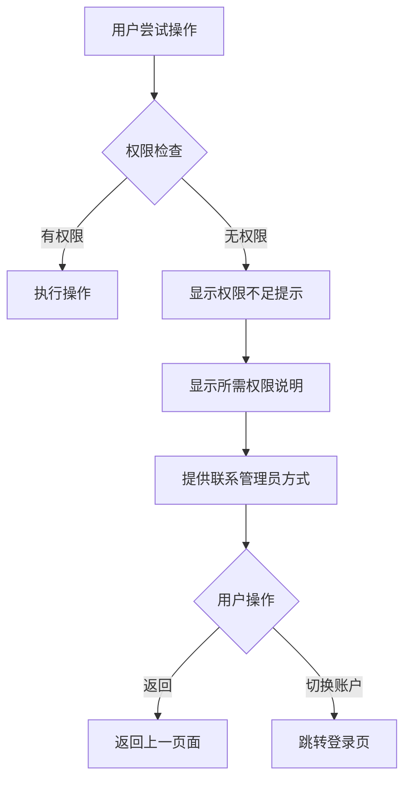
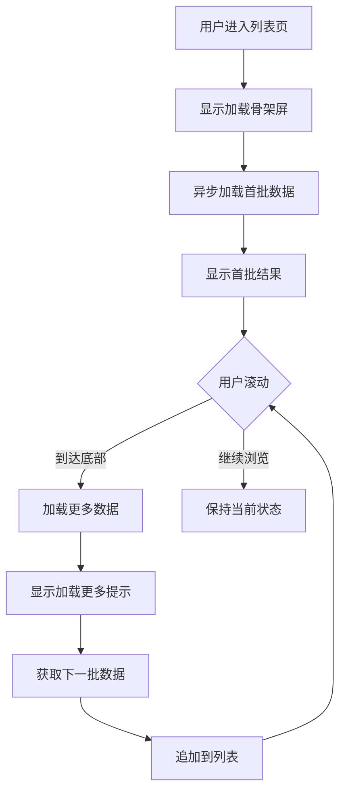
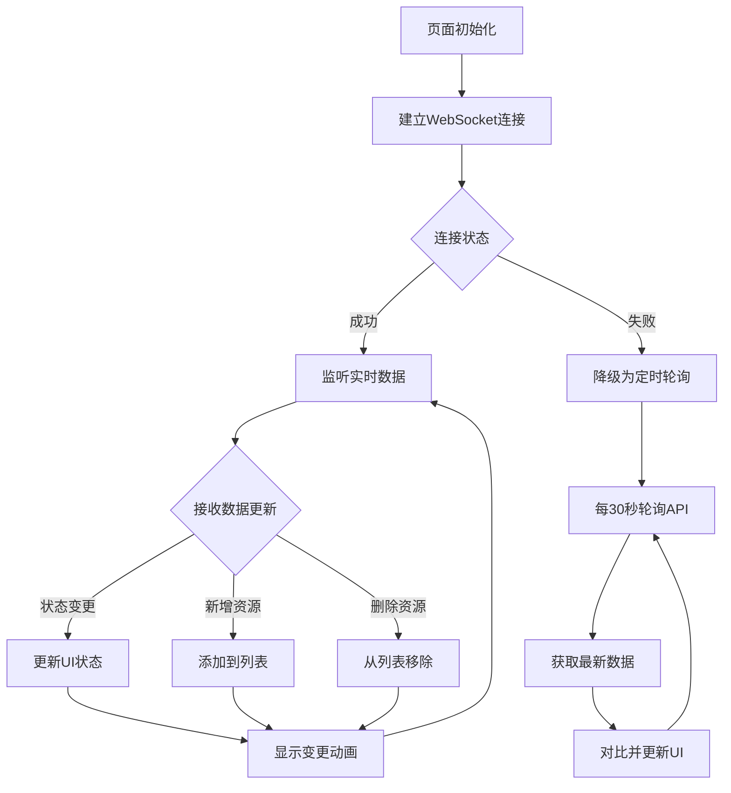
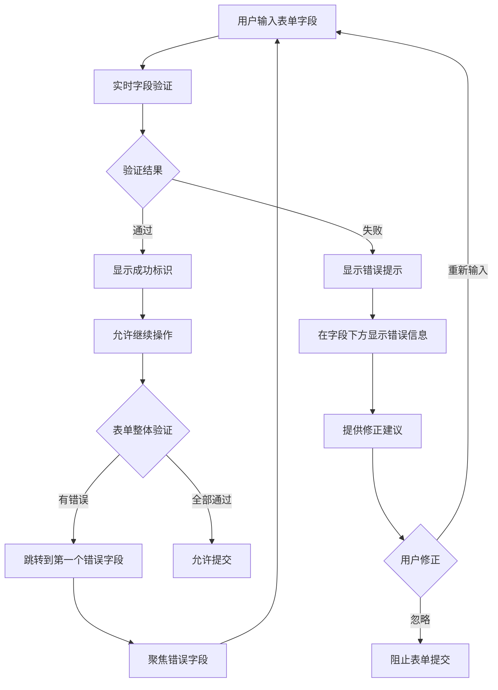

# 用户操作流程图 (User Operation Flowchart) - Karmada-Dashboard 用户体验优化

## 1. 文档概述

本文档定义了 Karmada-Dashboard 用户体验优化项目中主要用户操作的流程图，基于PRD文档中的核心功能需求和用户故事地图中的用户任务分解。流程图采用 Mermaid 语法，涵盖管理员和开发者的关键操作路径。

## 2. 核心用户角色

- **管理员 (王明)**: Kubernetes/Karmada 管理员，负责系统监控、集群管理、策略配置
- **开发者 (李娜)**: 应用开发者/DevOps 工程师，关注应用部署和资源管理

## 3. 主要操作流程

### 3.1 系统监控与感知流程



### 3.2 资源部署与管理流程

#### 3.2.1 通过表单创建Deployment流程

```mermaid
graph TD
    A[用户进入Deployments列表页] --> B[点击"创建Deployment"]
    B --> C{选择创建方式}
    C -->|表单创建| D[显示Deployment创建表单]
    C -->|YAML创建| E[显示YAML编辑器]
    
    D --> D1[填写基本信息]
    D1 --> D2{填写名称、Namespace、镜像}
    D2 -->|输入有误| D3[显示校验错误]
    D2 -->|输入正确| D4[填写容器配置]
    D3 --> D2
    
    D4 --> D5[配置端口、环境变量、探针等]
    D5 --> D6[配置分发策略]
    D6 --> D7{选择PropagationPolicy}
    D7 -->|选择已有PP| D8[从列表选择PP]
    D7 -->|新建PP| D9[弹出PP创建表单]
    
    D9 --> D10[选择目标集群方式]
    D10 --> D11{集群选择方式}
    D11 -->|直接选择| D12[勾选目标集群]
    D11 -->|标签选择| D13[配置集群标签选择器]
    D11 -->|可视化配置| D14[进入可视化调度配置]
    
    D12 --> D15[配置副本策略]
    D13 --> D15
    D14 --> D16[返回表单并应用配置]
    D16 --> D15
    
    D15 --> D17{选择副本分配模式}
    D17 -->|Duplicated| D18[设置每集群副本数]
    D17 -->|Divided| D19[设置总副本数及权重]
    
    D18 --> D20[保存新PP]
    D19 --> D20
    D8 --> D21[关联PP到Deployment]
    D20 --> D21
    
    D21 --> D22{提交创建请求}
    D22 -->|成功| D23[Deployment创建中状态]
    D22 -->|失败| D24[显示错误信息]
    D24 --> D25[修正错误]
    D25 --> D22
    
    D23 --> D26[跳转到Deployment详情页]
    D26 --> D27[查看分发状态]
    
    E --> E1[编写YAML配置]
    E1 --> E2{YAML语法校验}
    E2 -->|有错误| E3[显示语法错误]
    E2 -->|正确| E4[提交创建]
    E3 --> E1
    E4 --> D22
```

#### 3.2.2 资源编辑流程

```mermaid
graph TD
    A[用户在资源列表页] --> B[点击资源名称]
    B --> C[进入资源详情页]
    C --> D[点击"编辑"按钮]
    D --> E{选择编辑方式}
    E -->|表单编辑| F[加载现有数据到表单]
    E -->|YAML编辑| G[显示当前YAML]
    
    F --> F1[修改字段值]
    F1 --> F2{字段校验}
    F2 -->|有错误| F3[显示校验错误]
    F2 -->|正确| F4[提交更新]
    F3 --> F1
    
    G --> G1[编辑YAML内容]
    G1 --> G2{YAML校验}
    G2 -->|有错误| G3[显示语法错误]
    G2 -->|正确| G4[提交更新]
    G3 --> G1
    
    F4 --> H{更新请求}
    G4 --> H
    H -->|成功| I[显示更新成功]
    H -->|失败| J[显示错误信息]
    I --> K[返回详情页查看更新]
    J --> L[返回编辑]
    L --> E
```

### 3.3 可视化调度策略配置流程



### 3.4 调度关系树形图查看流程

```mermaid
graph TD
    A[用户在PropagationPolicy详情页] --> B[点击"调度关系树视图"]
    B --> C[显示策略树形图]
    C --> D[根节点显示策略名称]
    D --> E[展开Placement节点]
    E --> F{显示调度规则分支}
    
    F --> F1[ClusterAffinity分支]
    F --> F2[SpreadConstraints分支]
    F --> F3[Tolerations分支]
    F --> F4[ReplicaScheduling分支]
    
    F1 --> F1a[展开cluster名称列表]
    F1 --> F1b[展开标签选择器规则]
    F1a --> F1c[显示目标集群节点]
    F1b --> F1d[显示动态匹配的集群]
    
    F2 --> F2a{是否定义约束}
    F2a -->|已定义| F2b[显示约束规则详情]
    F2a -->|未定义| F2c[分支不显示]
    F2b --> F2d[显示拓扑域和参数]
    
    F3 --> F3a{是否定义容忍}
    F3a -->|已定义| F3b[显示容忍规则]
    F3a -->|未定义| F3c[分支不显示]
    F3b --> F3d[显示key、operator、value]
    
    F4 --> F4a[显示副本调度类型]
    F4a --> F4b{副本模式}
    F4b -->|Duplicated| F4c[显示复制策略]
    F4b -->|Divided| F4d[显示权重分配]
    
    F1c --> G[点击集群节点]
    F1d --> G
    G --> H[显示集群调度摘要]
    H --> H1[显示集群标签]
    H --> H2[显示集群污点]
    H --> H3[显示资源状态]
    H --> H4[显示预计副本数]
    
    H4 --> I{用户操作}
    I -->|展开其他节点| J[展开/折叠树节点]
    I -->|搜索集群| K[搜索特定集群]
    I -->|高亮路径| L[高亮到目标集群的规则路径]
    I -->|返回| M[返回策略详情页]
    
    J --> C
    K --> N[高亮匹配的集群节点]
    N --> C
    L --> O[高亮从根到叶的路径]
    O --> C
```

## 4. 异常处理流程

### 4.1 网络异常处理



### 4.2 权限不足处理



## 5. 性能优化考虑

### 5.1 大数据量加载流程



### 5.2 实时数据更新流程



## 6. 用户反馈与指导

### 6.1 表单验证反馈流程



## 7. 流程图使用说明

- **节点形状含义**:
  - 圆角矩形: 操作步骤
  - 菱形: 决策点
  - 矩形: 状态或页面
  - 椭圆: 开始/结束点

- **颜色约定** (实际实现时):
  - 绿色: 成功路径
  - 红色: 错误处理
  - 蓝色: 用户操作
  - 橙色: 系统处理

- **更新维护**:
  - 当产品功能迭代时，需同步更新相应流程图
  - 新增功能需要补充对应的操作流程
  - 定期评估流程的用户体验并优化

---

*本文档版本: v1.0 | 最后更新: 2024年* 